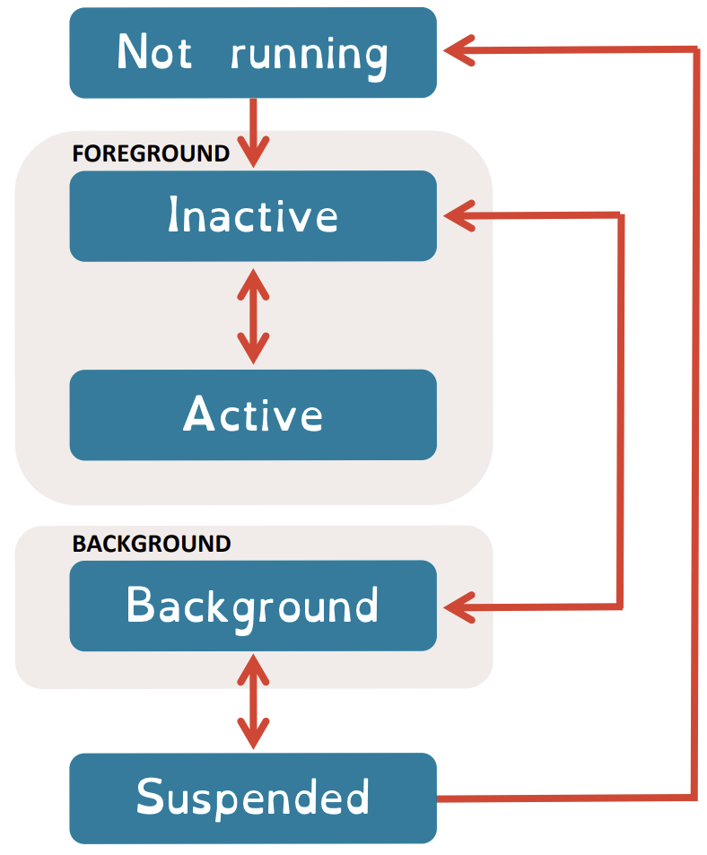

# edX First iOS App

## Starting App Development

- Projects VS Playgrounds
  - an Xcode Project allows you to create your finished apps ready for the App Store, whereas the Xcode Playground is more of a testing ground.
  - Projects allow you to store assets for your app development, along with describing the relationships between these assets. These could include things such as source code, libraries, images and frameworks.
  - Playgrounds are an interactive environment within Xcode that allows you to develop and test your Swift code in real-time. By clicking a 'Play' button at any stage of your development, you're able to check how your code is working. However, fully-fledged apps can't be made in Playgrounds.

### Create your first app

1. Open Xcode
2. Create a new Xcode project
3. Choose a template
   - platform: iOs
   - Application: App
   - Next
4. Choose options
   - Project Name: FirstApp
   - Organization Identifier: jin
   - Interface: Storyboard
   - Language: Swift
   - Uncheck all
   - Next
5. Choose folder
   1. Choose or create folder
   2. Uncheck Create Git repository on my Mac
   3. Create
6. Change the preview device
   1. Click Main.storyboard on the navigator
   2. option + cmd + return
   3. Click '+' on the botton
   4. Choose iPhoneSE 3rd
   5. option + cmd + return
7. Add a button to Main.storyboard
   1. Click Main.storyboard
   2. Click '+' (Library) button on the top
   3. Drag Button into Storyboard
   4. Modify the button
8. Show ViewController.swift on the right editor
   1. Click Add Editor button on Right on the top of editor
   2. Click ViewController.swift
   3. Close Main.storyboard on the Right Editor
9. Add controller for the button

   1. ctrl + drag the button to line 16 on ViewController.swift
   2. On the popup
      - Connection: Action
      - Object: View Controller
      - Name: jinButton
      - Type: UIButton
      - Connect
   3. Type code on ViewController.swift

      - ```swift
        import UIKit
        class ViewController: UIViewController {
          var colourIsYellow = false
          override func viewDidLoad() {
            super.viewDidLoad()
            // Do any additional setup after loading the view.
            view.backgroundColor = UIColor.purpleß
          }

          @IBAction func jinButton(_ sender: UIButton) {
          if colourIsYellow {
            view.backgroundColor = UIColor.purple
            colourIsYellow = false
          } else {
            view.backgroundColor = UIColor.yellow
            colourIsYellow = true
          }
        }
        ```

10. Play the app on Simulator
    1. Choose iOS, iPhone 8
    2. Click Start the active scheme

### Create your first app with SwiftUI

1. Open Xcode
2. Create a new Xcode project
3. Choose a template
   - platform: iOs
   - Application: App
   - Next
4. Choose options
   - Project Name: FirstAppSwiftUI
   - Organization Identifier: jin
   - Interface: SwiftUI
   - Language: Swift
   - Uncheck all
   - Next
5. Choose folder
   1. Choose or create folder
   2. Uncheck Create Git repository on my Mac
   3. Create
6. Preview
   1. Click `Resume`
   2. Choose a device on the toolbar
   3. Change code to 'hello, Jin' on `ContentView.swift`
7. Add a button and the action
   1. Remove `Text().padding()` from `ContentView.swift`
   2. Click '+' (Library)
   3. Drag Button to the location of `Text`
   4. Change the text to `Button("Our MOOC") {`
   5. Click '+' (Library)
   6. Type `vertical stack` and drag it to above the Button
   7. Move the Button into `VStack {}`
   8. Create a varibale and add action
   9. Add an image
      1. Download an image
      2. Click `Assets.xcassets`
      3. Drag the image to it
      4. Click `ContentView.swift`
      5. Click '+' (Library)
      6. Drag `vertical stack` into condition
      7. Click '+' (Library)
      8. Drag `image` into the `VStack`
      9. Copy the image name and paste into `Image("filename")`

- ```swift
  import SwiftUI

  struct ContentView: View {
    @State private var theMOOC = false
    var body: some View {
      VStack {
        Button("Our MOOC") {
          self.theMOOC.toggle()
        }
        if theMOOC {
          VStack {
            Image("floral-welcome-sign")
              .resizable()
              .scaledToFit()
            Text("Welcome to the MOOC!")
              .font(.largeTitle)
          }
        }
      }
    }
  }

  struct ContentView_Previews: PreviewProvider {
    static var previews: some View {
      ContentView()
    }
  }
  ```

### Hello World

#### On Terminal

1. Open terminal

- ```swift
  swift
  print("Hello World")
  :exit
  ```

#### On Playground

1. Open Xcode
2. File / New /Playground
3. iOS / Blank / Next
4. FirstPlayground / Create
5. Remove all code except `import UIKit`
6. Enter `print("Hello World")`
7. Click play botton below the line
8. Result will appear in the bottom of screen

### Constants and Variables

- Variable: store a value in memory
  - `var <variable_name> = <variable_value>`
- Constant: store a value that won't change, in memory
  - `let <constant_name> = <constant_value>`

### Data Types

- Defining a variable's data type to be stored in a variable happens when carting it
  - `var <variable_name>: <data_type> = <variable_value>`
  - | Type Name | Symbol | Purpose                     | Example |
    | --------- | ------ | --------------------------- | ------- |
    | Interger  | Int    | For whole numbers, integers | 4       |
    | Double    | Double | Numbers with decimal points | 4.6     |
    | Boolean   | Bool   | True or False               | true    |
    | String    | String | Text                        | "Here"  |

### Operators

- Are symbols, singular or combined, that allow you to check, change or combine values
  - | Operator Name  | Symbol | Purpose                                       | Example            |
    | -------------- | ------ | --------------------------------------------- | ------------------ |
    | Assignment     | =      | Assign a value to a variable                  | Greeting = "Hello" |
    | Addition       | +      | Add the values together                       | 25 + 25 = 50       |
    | Subtraction    | -      | Subtract the values                           | 22 - 11 = 11       |
    | Multiplication | \*     | Multiply the values together                  | 4 \* 7 = 28        |
    | Division       | /      | Divide the values                             | 12 / 4 = 3         |
    | Remainder      | %      | Returns the remainder of dividing the numbers | 12 % 5 = 2         |

## Control Flow and Advanced Variables

### if-else

- ```swift
  if <condition> {
    <code to execute when condition is true>
  } else {
    <code to execute when condition is false>
  }
  ```

### Logical Operators

- | Operator     | Description                                                                                    |
  | ------------ | ---------------------------------------------------------------------------------------------- |
  | ==           | The items must be equal to each other                                                          |
  | !=           | The values must not be equal to each other                                                     |
  | >            | The value on the left is greather than the value on the right                                  |
  | >=           | The value in the left is greather than or equal to the value on the right                      |
  | <            | The value on the left is smaller than the value on the right                                   |
  | <=           | The value on the left is smaller than or equal to the value on the right                       |
  | &&           | AND - the condition on the left must be true AND the condition on the right must be true       |
  | &#124;&#124; | OR - the condition on the left must be true OR the condition on the right must be true         |
  | !            | NOT - the opposite of the conditional statement immediately following the operator is returned |

### Switch

- ```swift
  var numberOfSiblings: Int = 2
  switch numberOfSiblings {
  case 0:
    print("only child")
  case 1:
    print("A single sibling")
  case 2:
    print("Two siblings")
  default:
    print("Wow...")

  // result: "Two siblings"
  ```

- Comparison Range

  - `...` or `..<`
    - `case 0..<2: // equal to 0...1`

### Collecgions

#### Array

- An ordered list of data of the same type
  - `var myIntegerList: [Int] = [1,2,3,4]`
- Data in an array is accessed by its index number
  - `print(myIntegerList[0] // returns 1`
- Operations that can be performed upon an array
  - | Operation name               | Description                                             |
    | ---------------------------- | ------------------------------------------------------- |
    | <array_name>.contains(x)     | If x is in the array, returns true else false           |
    | <array_name>.isEmpty         | Returns true if array is empty, otherwise returns false |
    | <array_name>.append(x)       | Appends x to the end of the array                       |
    | <array_name>.insert(x, at:y) | Inserts x into the array at position y                  |
    | <array_name>.remove(at:y)    | Removes the item at position y in the array             |
    | <array_name>.removeLast()    | Removes the last item in the array                      |
    | <array_name>.removeAll()     | Removes everything from the array                       |

#### Dictionary

- An unordered collection, and there is a key and a value
  - `var myDictionary = ["Name": "Jin", "Age": 20]
- Accessing a Key's value is done using if-let

  - ```swift
    if let age = myDictionary["Age"]{
      print(age)
    }
    ```

  - This ensures that the key exists before attempting to do anything with a value

- Changing a Dictionary

  - ```swift
    myDictionary["Age"] = 22 // replace the value if the key exists
    myDictionary.updateValue(39, forKey: "Age") // update
    myDictionary.removeValue(forKey: "Age") // remove
    ```

### for-in

- Allows us to repeat something that is in a sequence or range or collection

  - ```swift
    for num in 10...15{
      print("Number is: \(num)")
    }
    /* return
     * Number is: 10
     * Number is: 11
     * Number is: 12
     * Number is: 13
     * Number is: 14
     * Number is: 15
     */

    var lectures = ["David", "Paul", "Andrew"]
    for lecture in lectures{
      print("Lecturer is: \(lecturer)")
    }
    /* return
     * Lecturer is David
     * Lecturer is Paul
     * Lecturer is Andrew
     */

    var ages = ["David": 20, "Paul": 30, "Andrew": 40]
    for person in ages{
      print(person)
      print(person.key)
    }
    /* return
     * (key: "Andrew", value: 40)
     * Andrew
     * (key: "Paul", value: 30)
     * Paul
     * (key: "David", value: 20)
     * David
     */
    ```

### while

- Keeps looping until a condition is met

  - ```swift
    var points = 5
    var numberOfServes = 1
    while points < 50 && numberOfServes < 3{
      print("Playon, points = \(points)")
      points = points * 2
      numberOfServes = numberOfServes + 1
    }
    /* return
     * Playon, points = 5
     * Playon, points = 10
     */
    ```

## Xcode

- Create a new project
  1. Choose a template
     - iOS / App / Next
  2. Choose options
     - Product Name: TextChanger
     - Interface: Storyboard
     - Language: Swift
     - Next
  3. Choose a folder / Create
  4. Check the created project
     - Build Settings
       - Swift Language Version
- Navigation area (the left-hand side)
  - You can check files and the project structure
- Editor area (the middle)
  - We will see our code and do a while lot of things
  - On the top, there are 'Enable Code Review', 'Adjust Editor Options', and 'Add Editor on Right'
  - When you hold option key, the button will change to Add Editor Below
- Utility area (the right hand side)
  - options depending on what is selected
  - On the top, there are 'Show the File Inspector', 'Show the History Inspector', and 'Show Quick Help Inspector'
- Toolbar (the top)
  - On the right side, there are 'Library', 'Show or Hide Code Review', and 'Hide or Show the Inspector'
  - On the left side, there are 'Hide or Show the Navigator' and 'Start the active scheme'
  - On the middle, there are Project Name and Device
    - You can choose a device for 'Start the active Scheme'
    - You can connect iOS device via cable or wirelessly, and the connected device will show
- `Main.storyboard`
  - We can preview our device on the Editor area
  - On the toolbar, change the device and click the 'Start the active scheme' button
    - Simulator of the changed device will be created
    - On the menu bar, you can handle the simulator on the device tab
- `Assets.xcassets`
  - This is used to store things in it
- `Info.plist`
  - It contains the properties and setting of the app

## Pair iOS device with Xcode

1. Choose Window > Devices and Simulators, then in the window that appears, click Devices.
2. Connect the iOS device to your Mac with a lightning cable.
3. Note: The first time you connect an iOS device to your Mac, you may need to click Trust on the device to continue.
4. In the left column, select the device.
5. In the detail area, select Connect via network.
6. Xcode pairs with the iOS device.
7. Disconnect the lightning cable.
   - In the left column, a device that is connected (using a lightning cable or over the network) appears under Connected. If a network icon appears next to the device, the device is paired and it is safe to disconnect the lightning cable.

- Error: Xcode "Device Locked" when iPhone is unlocked
  1. Unplug device
  2. Quit Xcode
  3. Open Xcode
  4. plug in device
- Error: Signing for "..." requires a development team.
  1. Add you Apple ID in Xcode
     - On menu bar, Xcode > Preferences > Accounts > Add Apple ID
  2. Choose your project > Choose a target > Click Signing & Capabilities tab
     - Check Automatically manage signing
     - Choose Team
- Untrusted Developer on iPhone
  - Settings > General > VPN & Device Management > Select Developer App > Trust

## Interface Builder

- .storyboard files:
  - contain parts of the interface
  - define the layout of one or many screens
  - the moving from one screen to another

### Elements position center on different devices and the rotation

- `Main.storyboard`
  1. Click '+' (Library), and add Button and Label
  2. Select Button on the preview
     1. Click "Show the Attribute Inspector" on the right hand side
     2. Change the Title to 'TextChange'
     3. Click "Align" on the bottom of the preview
     4. Check "Horizontally in Contianer" and "Vertically in Container"
     5. Click "Add 2 Constraints"
     6. Change the device on the bottom of the preview and test it
     7. Click the "orientation" on the bottom of the preview and test it
  3. Select Label on the preview
     1. Click "Add New Constraints" button on the bottom of the preview
     2. Click the red line below the black box in the middle to select the Spacing to nearest neighbor, and uncheck "Constrain to margins"
     3. Click "Add 1 Constraint" button
     4. Click "Align" on the bottom of the preview
     5. Check "Horizontally in Container"
     6. Click Add 1 "Constraints"
  4. You can check added Constraints on View Controller Scene > View Controller > View > Constraints
  5. You can check what is the scene by click "Show the Identity Inspector" on the right hand side

### Add the button action

1. Control + click the button on the storyboard and drag the bottom to line 16 (between the last two brackets) on `ViewController.swift`
2. Change the type to "UIButton"
3. Name: textChange
4. Click Connect
5. Control + click the label on the storyboard and drag the bottom to line 11 (under the UIViewController line) on `ViewController.swift`
6. Name: theMessage
7. Click Connect
8. Type action code

   - ```swift
     theMessage.text = "I'm an app developer"
     print("You pressed the button!")
     ```

9. When you click the button, you can see the text appear at the bottom of your screen, in the debug area

## Developer Documentation

- Hover over the UIlabel
- While you've got the Option key down, a question mark appears
- Click the question mark
- The developer documentation has ginve you a brief summary
- Click "Open in Developer Documentation"

## Debugging

- Compiler Errors
  - When the run button is clicked, Xcode takes the code you wrote, combines it with the code in things such as UILabel & creates an executeable file
  - This is called comiling your code
  - The executable file is what runs on the device
  - When the code can't compile, a compiler error occurs
  - These usually occur when the written code has an error in it
- Run time Errors
  - These are what are really referred to as Bugs
  - The code compiles without errors and starts executing
  - While running the code stops or crashes
  - This is where the code did something it wasn't meant to and can't continue on
  - Most of use have experienced these when using software, and they avr frustrating for both users and developers

## Exercise

### Change Label

- ```swift
  //
  //  ViewController.swift
  //  TextChanger
  //
  //  Created by Jungjin Park on 2022-07-30.
  //

  import UIKit

  class ViewController: UIViewController {

    @IBOutlet weak var theMessage: UILabel!
    @IBOutlet weak var counterDisplay: UILabel!

    var iAmADeveloper : Bool = false
    var counter: Int = 0

    override func viewDidLoad() {
      super.viewDidLoad()
      // Do any additional setup after loading the view.
    }

    @IBAction func textChange(_ sender: UIButton) {
      counter = counter + 1
      if !iAmADeveloper{
        theMessage.text = "I'm an app developer"
      } else {
        theMessage.text = "I'm going to be an App Developer!"
      }
      iAmADeveloper = !iAmADeveloper

      print("You coded the button press!")
      counterDisplay.text = "Counter: \(counter)"
    }
  }
  ```

### Change background color depending on user input

- ```swift
  //  ViewController.swift
  //  TextChanger
  //
  //  Created by Jungjin Park on 2022-07-30.
  //

  import UIKit

  class ViewController: UIViewController {

    @IBOutlet weak var theMessage: UILabel!
    @IBOutlet weak var enteredColour: UITextField!

    var userInput : String = ""

    override func viewDidLoad() {
      super.viewDidLoad()
      // Do any additional setup after loading the view.
    }

    @IBAction func textChange(_ sender: UIButton) {
      enteredColour.resignFirstResponder()
      userInput = enteredColour.text!
      switch userInput{
      case "blue":
        view.backgroundColor = UIColor.blue
      case "green":
        view.backgroundColor = UIColor.green
      case "yellow":
        view.backgroundColor = UIColor.yellow
      case "orange":
        view.backgroundColor = UIColor.orange
      default:
        theMessage.text = "It's an unknown colour entered."
      }
    }
  }
  ```

### Temperature Converter

- ```swift
  import UIKit

  class ViewController: UIViewController {

    @IBOutlet weak var celsiusInput: UITextField!
    @IBOutlet weak var fahrenheitInput: UITextField!
    @IBOutlet weak var convertedValue: UILabel!

    var degreesValue: Double? = 100
    var fahrenheitValue: Double? = 0.0

    override func viewDidLoad() {
      super.viewDidLoad()
      // Do any additional setup after loading the view.
    }

    @IBAction func celToFah(_ sender: Any) {
      fahrenheitInput.text = ""
      if celsiusInput.text != ""{
        view.backgroundColor = UIColor.green
        degreesValue = Double(celsiusInput.text!)

        fahrenheitValue = (degreesValue! * 9/5) + 32
        convertedValue.text = "\(fahrenheitValue!) Fahrenheit"
        print("\(degreesValue!) = \(fahrenheitValue!) in fahrenheit.")
      } else {
        convertedValue.text = "Enter Celsius Value"
      }
    }
    @IBAction func fahToCel(_ sender: Any) {
      celsiusInput.text = ""
      if fahrenheitInput.text != "" {
        view.backgroundColor = UIColor.yellow
        fahrenheitValue = Double(fahrenheitInput.text!)
        degreesValue = (fahrenheitValue! - 32) * 5/9
        convertedValue.text = "\(degreesValue!) Degrees"
        print("\(fahrenheitValue!) = \(degreesValue!) in degrees.")
      } else {
        convertedValue.text = "Enter Fahrenheit Value"
      }
    }
  }
  ```

## Functions

- Functions are blocks of code that can be run over and over again to do the same things
- They saves us writing out code over and over again, possibly introducing transcription errors
- Functions should do one thing. If we want to do two things, we can write two functions
- A function has two important components
  1. The function definition, where we specify what the function does.
     - A function definition has four components: name, input parameters, output return values and the body
     - The function body is what turns the inputs into the outputs.
     - `func functionName (InputParameters) -> OutputReturnType { // FunctionBody }`
  2. The function call, where we execute the function
     - `functionName()`

### Function Parameters

- They allow us to specify the name, type and quantity of data that will be processed by the function body.
- When we call the function, we can apply the same steps to different data
- There are three board situations to consider:
  - functions with no input parameter
    - definition: `functionName() {}`
    - call: `functionName()`
  - functions with one input parameter
    - definition: `functionName(parameter: type) {}`
    - call: `functionName(parameter: value)`
    - We must specify a name for the parameter that describes its purpose
    - The parameter becomes a variable we can use within the function
    - We also have to specify the data type of the parameter
  - functions with multiple input parameters:
    - definition: `functionName(firstParameter:dataType, secondParameter:dataType) {}`
    - call: `functionName(firstParameter: value, secondParameter: value)`
    - a function should only do one thing; if we have too many (approx. > 6) parameters, it is likely doing to much
- Default Parameter Values
  - When calling the funciton, we don't have to specify all the parameters
  - If we don't we need a default value to use so the function can still run
  - We should have the default parameters at the end of the parameter list
    - This ensures that all calls to the function use the same order for their non-default arguments, and makes it cleear that the same function is being called in each case
  - definitions: `functionName(firstParameter: Int, secondParameter: Int = 10) {}`

### Function Returns

- The value(s) we calculated within the function can be used outside the function
- when calling functions that return, we don't have to have the smae names for the variables storing the returns as within the function
- No reutrns
- One return
  - All that is required is to make the last line of the function start with return, then specify the variable containing the value to return
  - If you return earlier in the function, any lines afterwards will be ignored
  - `return value`
- Multiple returns

  - All we have to do is separate the returns by a comma

- function definition

  - ```swift
    func thisDivides(number: Int) -> (Int, Int) {
      let value1 = number / 2
      let value2 = number / 4
      return (value1, value2)
    }
    ```

- function call

  - ```swift
    var (div_two, div_four) = thisDivides(number: 16)
    print(div_two) // 8
    print(div_four) // 4
    ```

- Exercise: Multiple Returns
  - Define a function called 'calcSumDiff' that for two input parameters 'firstNum' and 'secondNum' will output the sum and the difference of the two numbers.
  - Call your function and store the results in appropriately named variables.
- Then, print the values of these to confirm the function works as intended

  - ```swift
    func calcSumDiff(firstNum: Int, secondNum: Int) -> (Int, Int) {
      let sum = firstNum + secondNum
      let diff = abs(firstNum - secondNum)
      return (sum, diff)
    }

    let result = calcSumDiff(firstNum: 10, secondNum: 12)
    print(result) \\ return (22, 2)
    ```

## Structures

- A Structure contains one or more variables (called properties)

  - ```swift
    struct Person { var anme: string }
    var aPreson = Person(name: "Tim")
    print(aPerson.name)
    // return Tim
    ```

- We can also add methods (functions) to it as well

  - ```swift
    struct Person {
      var name: String
      var age: Int
      var location: String

      func whoAmI() {
        print("Hi, I'm \(name)! I'm \(age) and live in \(location)")
      }
    }

    let aPerson = Person(name: "Jin", age: 20, location: "Victoria")

    print(aPerson.name) // Jin
    aPerson.whoAmI()   // Hi, I'm Jin! I'm 20 and live in Victoria
    ```

- An `initializer` creates an instance of a structure

  - This involves creating an instance of each property
  - We can specify default values for the properties

  - ```swift
    struct WaterMeter {
      var litersUsed: Int = 0
      var customer: Person = Person(name: "Anonymous", age: 20, location: "Canada")
    }

    let theMeter = WaterMeter()

    print(theMeter.litersUsed)  // 0
    print(theMeter.customer.age) // 20
    ```

- When we specify the values when we create an instance, this is called using the `memberwise initializer`
  - `var aWaterMeter = WaterMeter(literUsed: 10)`
- `Custom Initializer`: In more complicated situations, we may wish to write our own initializer functions

  - ```swift
    struct CarSpeed {
      var kph: Double   // only kph is stored
      init(kph: Double) { // Basic initializer for kph
        self.kph = kph
      }
      init(mph: Double) { // Advaced logic in initializer for mph
        self.kph = mph * 1.6
      }
    }
    var firstSpeed = CarSpeed(kph: 100)
    var sameSpeed = CarSpeed(mph: 60)
    ```

- `Computed Properties`

  - ```swift
    struct CarSpeed {
      var kph: Double
      var nph: Double {
        return kph / 1.6
      }
    }
    ```

- `Mutating Methods`: Added methods to a structure that change the values of the properties

  - ```swift
    struct CarSpeed {
      var kph: Int = 0
      mutating func reset() {
        kph = 0
      }
    }
    var myCarSpeed = CarSpeed(kph: 100) // kph is 100
    myCarSpeed.reset()         // kph is 0
    ```

- Type Properties and Methods stay the same for all instances of a structure

  - Add `static` before a property or method

  - ```swift
    struct CarSpeed {
      static var legalLimit = 100
    }
    ```

- `self` simply refers to the current instance of a structure (or other object)
- This allows us to interact with the current instance, for example to set or access its properties

- Exercise: Detailed Person

  - Modify the Person structure such that we also store their favourite food and their height. Choose appropriate data types for these properties.
  - Add a second function to the Person structure named 'foodAndHeight' to output these new properties in a human-readable manner.

- Initialise the Structure you've created, and call your new function to confirm the changes work as intended

  - ```swift
    struct Person {
      var name: String;
      var age: Int;
      var location: String;
      var favouriteFood: String;
      var height: Int;

      func whoAmI() {
        print("Hi, I'm \(name)! I'm \(age) and live in \(location).");
      }

      func foodAndHeight() {
        print("My favourite Food is \(favouriteFood), and I'm \(height)cm tall.")
      }
    }
    let bPerson = Person(name: "Jin", age: 20, location: "Canada", favouriteFood: "Galbi", height: 180);
    bPerson.foodAndHeight() // returns My favourite Food is Galbi, and I'm 180cm tall.
    ```

## Classes

- Classes differ from structures as classes can hoave hierarchical relationship
- Classes can have parents (named superclasses) or children (named subclasses)

- Base Classes don't have a parent

  - ```swift
    class Animal {
      var animalName: String
      var numberOfLimbs: Int
      func makeNoise() {
        //
      }
    }
    ```

- Subclassing allows us to extend an existing class by basing it on an existing class (and its methods and properties)

  - ```swift
    class Dog:Animal {
      var breed: String
      override function makeNoise() {
        print("Woof!")
      }
    }
    ```

- If we add more properties to our subclass, we need to override the initializer as it will only initialize the superclasses' properties

  - ```swift
    class Dog:Animal {
      var breed: String
      init(animalName: String, numberOfLimbs: Int, Breed: String) {
        self.breed = breed
        super.init(animalName: animalName, numberOfLimbs: numberOfLimbs)
      }
    }
    ```

- ```swift
  class Animal {
    var name: String
    var numberOfLimbs: Int

    func makeNoise() {
      // Do nothing!
    }
    init(name: String, numberOfLimbs: Int) {
      self.name = name
      self.numberOfLimbs = numberOfLimbs
    }
  }

  class Cat: Animal {
    var breed: String = ""

    override func makeNoise() {
      print("Meow!")
    }

    init(name: String, numberOfLimbs: Int, breed: String) {
      self.breed = breed
      super.init(name: name, numberOfLimbs: numberOfLimbs)
    }
  }

  let myCat = Cat(name: "Whiskers", numberOfLimbs: 4, breed: "Ragdoll")
  print(myCat.name)
  myCat.makeNoise()

  let myAnimal = Animal(name: "Miscellaneous", numberOfLimbs: 0)
  print(myAnimal.name)
  myAnimal.makeNoise()

  print(myCat.breed)
  ```

- Exercise: Another Animal

  - Create a new Subclass of Animal for a Snake. It should store a true or false value regarding whether it is poisonous, a value of its length as well as ensuring its makeNoise function outputs a 'Hiss'.
  - Ensure that you have define the initialiser for the Snake.

- As snakes can be (for this purpose) considered to have zero limbs, pass the value directly into the superclass initialiser

  - ```swift
    class Snake:Animal {
      var poisonous: Bool = false;
      var snakeLength: Double

      override func makeNoise() {
        print("Hiss")
      }
      init(animalName: String, numberOfLimbs: Int = 0, poisonous: Bool, snakeLength: Double) {
        self.poisonous = poisonous
        self.snakeLength = snakeLength
        super.init(animalName: animalName, numberOfLimbs: numberOfLimbs)
      }
    }
    let aSnake = Snake(animalName: "Bell Snake", poisonous: true, snakeLength: 100)
    let bSnake = Snake(animalName: "Bella Snake", numberOfLimbs: 4, poisonous: true, snakeLength: 100.3)

    aSnake.makeNoise()     // Hiss
    print(aSnake.numberOfLimbs) // 0
    print(aSnake.snakeLength)  // 100.0

    bSnake.makeNoise()     // Hiss
    print(bSnake.numberOfLimbs) // 4
    print(bSnake.snakeLength)  // 100.3
    ```

## Introduction to User Interface Development

### Basic Views

- User Interface Components: Apple's UIKit provides us with the components we can use to make our own
- Views: A view is a visual element that makes up our app
  - We can create text, graphics, lines and more with them
  - Most apps contain screens which are made up of many niews, which create what is termed a view hierarchy
  - Views need a Frame (size and position) first
- UIView: The UIView class is UIKit's foundational class
  - This is subclassed to make many components we can use to build our app's interface
- UILabel: A UILabel allows us to display a piece of short text (in our app) to the user
- UIImageView: It allows us to display an image to the user
- UITextView: It allows a user to interact with multiple lines of test within the app
- UIScrollView: It allows users to scroll
  - The benefit of this is to add and explore content larget than the viewport (screen/window)
  - Scrollbars (or indicators as they termed) only appear when the user scrolls
- UIToolbar: It displays a group of buttons at the bottom of the screen (usually)
  - Buttons (or tools) allow users to perform an action
- UINavigationBar: It can be thought of as the 'title bar' - but isn't the only way to make one
  - It has buttons to navigate through the view hierarchy (back, forwards etc)
  - It looks like it sometimes has other buttons (although they are not implemented using a UINavigationBar)
- UITabBar: It looks similar to a UIToolbar, but serves a different yet similar purpose
  - Rather than performing actions, a UITabBar allows the user to select between views
  - It's used in conjunction with a TabBarController
  - It is best used for when the app has multiple workflows i.e. doesn't just run from start to finish like a 'wizard'

#### Playgounds Basic Views

- in Cocoa Touch

  - Xcode > File > New > Playground > iOS > Single View

  - ```swfit
    //: A UIKit based Playground for presenting user interface

    import UIKit
    import PlaygroundSupport

    class MyViewController : UIViewController {
      override func loadView() {
        let view = UIScrollView()
        view.backgroundColor = .white
        view.contentSize = CGSize(width: 375, height: 1000)

        let label = UILabel()
        label.frame = CGRect(x: 50, y: 200, width: 200, height: 20)
        label.text = "Hello World!"
        label.textColor = .black

        view.addSubview(label)

        let textView = UITextView()
        textView.frame = CGRect(x:50, y:240, width: 200, height: 100)
        textView.text = "Tap to edit me - I'm a TextView!"
        textView.textColor = .black

        view.addSubview(textView)

        self.view = view
      }
    }
    // Present the view controller in the Live View window
    PlaygroundPage.current.liveView = MyViewController()
    ```

- in SwiftUI

  - Xcode > File > New > Playground > iOS > Blank

  - ```swift
    import SwiftUI
    import PlaygroundSupport

    struct Name {
      var firstName: String = ""
      var lastName: String = ""
    }

    struct NameRow: View {
      var name: Name
      var body: some View {
        HStack {
          Text(name.firstName)
          Text(name.lastName).bold()
        }
      }
    }

    struct NameView: View {
      var body: some View {
        Group {
          NameRow(name: Name(firstName: "Jin", lastName: "Park")).offset(x:1, y:0)
          NameRow(name: Name(firstName: "Jina", lastName: "Park")).offset(x:0, y:0)
        }
      }
    }

    PlaygroundPage.current.setLiveView(NameView().padding(150))
    ```

### Basic Controls

- Controls allow us to setup Actions that respond to events (interactions) with the controls
  - An Action is simply a special type of function
- UIButton: It is a control which the user can 'tap'
- UISegmentedCongrol: Think of a UISegmentedControl as a group of buttons where only one can be selected
  - Code is run when the user selects a different button
- UITextField: It is similar to a UITextView or a UILabel
  - In that it allows the user to enter a single line of text - these are properties of those Views
  - Code can also be bound to after each keystroke (use this carefully)
- UISlider: It allows the user to select a continuous value between a lower and upper range
  - As the user drags the slider toggle, code is run, so dragging can trigger an event many times
- UISwitch: They are to controls what Boolean values are to variables
  - Code can run for when the state changes or when it is set to a specific value
- UIDatePicker: It sllows the user to select a date and time
  - Code is executed when date and/or time is changed
- UIViewController: It is not really a control, but a special case view
  - Each screen in an app is usually a scene in Storyboards
  - UIViewControllers manage each view - they contain the Actions and the Storyboards used to generate each screen or scene
  - These are subclassed and overridden to allow us to make our own scenes

#### Playgrounds: Basic Controls

- in SwiftUI

  - Xcode > File > New > Playgrounds > iOS > blank

  - ```swift
    import SwiftUI
    import PlaygroundSupport

    struct AToggle: View {
      @State var isToggled = false
      var offDescription: String
      var onDescription: String
      var body: some View {
        Toggle(isOn: $isToggled) {
          if(isToggled) {
            Text(onDescription)
          } else {
            Text(offDescription)
          }
        }
      }
    }

    struct MainView: View {
      var body: some View {
        VStack {
          Group {
            AToggle(offDescription: "Off 1", onDescription: "On 1")
            AToggle(offDescription: "Off 2", onDescription: "On 2")
          }
          Button(action: {
            print("Tapped")
          }, label: {
            Text("I am a button!")
          })
        }
      }
    }

    PlaygroundPage.current.setLiveView(MainView().padding(150))
    ```

- in Cocoa Touch

  - ```swift
    import UIKit
    import PlaygroundSupport

    class MyViewController : UIViewController {
      @objc func buttonTapped() {
        print("Tapped the button!")
      }
      @objc func datePickerValueChanged() {
        print("Changed value of the date picker!")
      }
      override func loadView() {
        let view = UIScrollView()
        view.backgroundColor = .white
        view.contentSize = CGSize(width: 375, height: 1000)

        let button = UIButton()
        button.frame = CGRect(x:0, y: 20, width: 100, height: 20)
        button.setTitle("Tap Me", for: .normal)
        button.setTitleColor(.blue, for: .normal)
        button.addTarget(self, action: #selector(buttonTapped), for: .touchDown)

        view.addSubview(button)

        let datePicker = UIDatePicker()
        datePicker.frame = CGRect(x:0, y: 0, width: 375, height: 500)
        datePicker.addTarget(self, action: #selector(datePickerValueChanged), for: .valueChanged)

        view.addSubview(datePicker)
        self.view = view
      }
    }
    // Present the view controller in the Live View window
    PlaygroundPage.current.liveView = MyViewController()
    ```

## Auto Layout

1. Xcode > File > New > Project
2. iOS > App > Next
3. Interface: Storyboard, Language: Swift > Next
4. Create
5. Change device to iPhone8
6. On `Main.storyboard`
   1. Change the preview device to iPhoneSE
   2. Centered button
      1. Click Library on the toolbar (the top)
      2. Add a button on the middle
      3. Align > Check Horizontally in Container and Vertically in Container > Click Add 2 Constraints
      4. Add New Constraints > Set 20 on each side > Click Add 2 Constraints
   3. Warning - Fixed leading and trailing constraints with a center constraint may cause clipping
      1. On Size Inspector > remove Horizontal center constraint
         1. Click Horizontal Center Constraint
         2. Pushing delete button
      - When constraints have issues, solving methods
        - Modifying Constraints form the Size Inspector on the Utility Area
        - Clicking Resolve Auto Layout Issues on the bottom of the preview to change the constraints to fit the object
        - Clicking Update Frames on the bottom of the preview to change the object to fit the constraints
   4. Stack View
      1. Add a label on the top center from library
      2. Warning - Views without any layout constraints may clip their content or overlap other views
         1. Align > Check Horizontally in Container > Add 1 Constraint
      3. Warning - Vertical position is ambiguous for "Label"
         1. Add New Constraints > Choose Safe Area on the top > Add 1 Constraint
      4. Add a label below the label and change the Label to "Second Label"
      5. Add New Constraints > Type 20 on the top > Add 1 Constraint
      6. Warning - Horizontal position is ambiguous for "Second Label"
         1. Align > Check Horizontally in Container > Add 1 Constraint
      7. Add Third Label as same as the Second Label
         1. Change the font to System 40
      8. Select the three labels with Shift key
      9. Editor on the menu bar > Embed In > Stack View
      10. Align > Check Horizontally in Container > Add 1 Constraint
      11. Add New Constraints
          1. Choose Safe Area at the top
          2. Type 100 at the bottom
          3. Add 2 Constraints
      12. On Attribute Inspector of Stack View
          1. Axis
          2. Alignment (Vertically)
          3. Distribution (Horizontally)
          4. Spacing
          5. Click '+' (Add Variation) next to Spacing for iPad
             1. Width: Regular
             2. Height: Regular
             3. Click Add Variation
      13. Click layout at the bottom of the preview
          1. You can test it on Full Screen or Split View
      14. On Attribute Inspector of label
          1. Click '+' (Add Variation) next to Drawing for iPad
             1. Width: Compact
             2. Height: Regular
             3. Click Add Variation
             4. Check Hidden
             5. You can check it on layout at the bottom of the preview

## Scenes

- A scene is simply 'one thing' we can do in our app that is described by 'one screen'
- Complex apps will require multiple scenes to be able to deliver the required functionality

### Segues

- A `segue` defines how a new ViewController appears over the previous ViewController
- We can also use `segues` to dismiss View Controllers to move back to previous ones, and these are termed `modal segues`.

#### Demo: Creating Modal Segue Project

1. Create project
2. iOS > App > Next
3. Storyboard / Swift > Next
4. Create
5. Click Main.storyboard from the navigation
6. Select the view controller
   - Change the Background color to yellow on the attribute inspector
7. Click library and add a button at the middle and change the title to First
8. Click library and add view controller to next to the view controller
   - Change the Background color to purple on the attribute inspector
9. Click the button and Ctl + drag it to the purple view controller
   - Select "Present Modally"
10. One more for yellow view controller
11. Click Storyboard Segue between View Controllers
    - You can change the attributes from the inspector
12. On ViewController.swift, add below code after override func

    - ```swift
      @IBAction func unwindToOrange(unwindSegue: UIStoryboardSegue) {}
      ```

13. Click library and add a button to orange view and change the title to Dismiss
    - Click the button and Ctl + drag it to exit at the top of the view controller
    - Select unwindToOrangeWithUnwindSegue

### Triggers

- Segues can be triggered either using the Interface Builder or programmatically using Swift code
  - We generally connect the trigger to a control such as a button, so the segue is triggered when the user taps the button

### Unwinding

- Dismissing a segue is termed `unwinding` it
  - We can't really do this using Interface Builder
  - We do this programmatically by creating an `IBAction` function that takes a `UIStoryboardSegue` parameter
  - We then need to connect the IBAction to a control, which we will do in the exercise

### Navigation Controllers

- Using a Navigation Controller we can push a new ViewController on top of the stack with a push transition

#### Demo: Navigation Controller

1. Cont'd Segue demo
2. On Main.storyboard, Click the first View Controller
3. On the menu bar
   1. Editor > Embed In > Navigation Controller
4. Click Segue between first and second view controller
5. On the Attribute Inspector, change the Kind to "Show (e.g. Push)"
   1. You can see "< Back" on the second view controller
6. Same thing again to the seque between second and third
7. Change Navigation title style
   1. Click title on the Navigation Controller
   2. On the Attribute Inspector, change the style, title,
8. Click Library and add Bar Button Item to the right side of the navigation section on third view controller
9. On the Attribute Inspector, change System Item to Custom and Title to Dismiss
   1. Click the button and Ctl + drag it to exit at the top of the view controller
   2. Select unwindToOrangeWithUnwindSegue

### Navigation Bars and Items

- This can be customized visually in Interface Builder, keeping in mind the Human Interface guidelines
- The Navigation Bar is implemented ad a `UINavigationBar`
- To customize what the bar says, we need to modify the Navigation Item within our View Controller
- We can customize the style by modifying the attributes of the Navigation Bar

### Passing Information

- Generally, we will need to pass information between View Controllers
  - This is despite changing View Controllers to a different `task`, as it is still part of a larger workflow
- We override the `prepare` function to setup data for transfer during a segue
- The `prepare` function is how we programmatically define a segue

#### Demo: Passing Data between ViewControllers

1. Cont'd Navigation Controller Demo
2. Click Libaray and add Text Field to below the button on the first view controller
3. Click the text field and drag it to above override func viewDidLoad() on ViewController.swift

   1. Name: textField
   2. Click Connect
   3. It will create `@IBOutlet weak var textField: UITextField!`
   4. Type a code below the code

      - ```swift
        override function prepare(for segue: UIStoryboardSegue, sender: Any?) {
          segue.destination.navigationItem.title = textField.text
        }
        ```

4. Click "Start the active scheme"
5. On a simulator, type test text on the textField
6. Click First button
7. The test text will be shown as the navigation title on the second view controller

#### Demo: Integrating Controls with Segues

1. Cont'd Passing Data Demo
2. Remove Navigation Controller
3. Click the first view controller
4. On the Attribute Inspector > Check "Is Initial View Controller"
5. Remove Text Field from Main.storyboard and ViewController.swift
6. Change the title of first button to Purple
7. Click Library and add button to below the purple button
8. Change the title to Orange
9. Click Library and add switch to below the orange button
10. Click First on the top of the first view controller
11. Ctrl + Drag to the purple view controller > Select Present Modally
12. Ctrl + Drag to the orange view controller > Select Present Modally
13. Click the Storyboard Segue to purple
    1. On the Attribute Inspector
    2. Identifier: purple
14. Click the Storyboard Segue to orange
    1. On the Attribute Inspector
    2. Identifier: orange
15. Click the switch > Ctrl + drag into the first line of ViewController class on ViewController.swift
    1. Connection: Outlet
    2. Name: segueSwitch
    3. Click Connect
16. Click the purple button > Ctrl + drag into the next line of ViewController class on ViewController.swift
    1. Connection: Action
    2. Name: tapPurple
    3. Click Connect
17. Click the orange button > Ctrl + drag into the next line of ViewController class on ViewController.swift
    1. Connection: Action
    2. Name: tapOrange
    3. Click Connect
18. On ViewController.swift

    - ```swift
      @IBOutlet weak var segueSwitch: UISwitch!

      @IBAction func tapPurple(_ sender: Any) {
          if segueSwitch.isOn {
              performSegue(withIdentifier: "purple", sender: self)
          }
      }
      @IBAction func tapOrange(_ sender: Any) {
          if segueSwitch.isOn {
              performSegue(withIdentifier: "orange", sender: self)
          }
      }
      ```

## Tab Bar Controllers

- Tab Bar Controllers are commonly seen in many apps to separate different workflows within an App
- To add a Tab Bar Controller in Interface Builder, we drag it onto the Canvas from the Object library
- To add a tab, we drag it from the Object library into our TabBarController
- Each of these tabs is termed a Tab Bar Item
- Tab Bar Item has a Label and an Image
  - We can use a bunch of built-in icons or supply our own
- We can customize the look and feel further using Swift code

### Exercise: Tab Bar Controllers

1. Create a new project
2. Open Main.storyboard
3. On menu bar, Editor > Embed In > Tab Bar Controller
4. Create two View Controller; Click Library > View Controller
5. Click Tab Bar Controller
   1. Ctrl + Drag to the second view controller > Select View Controllers on Relationship Segue
   2. Click the Relationship Segue > Enter Selector: second on the Attribute Inspector
   3. Ctrl + Drag to the third view controller > Select View Controllers on Relationship Segue
   4. Click the Relationship Segue > Enter Selector: third on the Attribute Inspector
   5. Click the Relationship Segue with the first > Enter Selector: first on the Attribute Inspector
6. Click the first view controller
   1. Change the background color to system orange (,purple, yellow)
   2. Click Item on the top
   3. On the Attribute Inspector, change the title to First VC
   4. Click Item on the bottom
   5. On the Attribute Inspector, change the title to Orange
7. for the second view controller and the third view controller do the same thing as the first

## ViewController Event Handling

- Life Cycle States
  - A View Controller can be in one of the following states:
    - View not loaded
    - View appearing
    - View appeared
    - View disappearing
    - View disappeared
- View Did Load
  - The most common function is viewDidLoad, which runs when the View Controller is loaded
  - Generally this function is used to programmatically initialize the View Controller
    - Set up values, connect to resources, etc.
- Overriding

  - One think to be aware of is that as we are overloading each of these functions, you must call the superclass initialiser within them when you do so

  - ```swift
    override func viewWillAppear(_animated: Bool) {
      super.viewWillAppear(animated)
      // you write your code here
    }
    ```

- Function with `will` run before the event, whereas functions with 'did' run afterwards

## Navigation Hierarchy

### Hierarchical Navigation

- A user makes one choice per screen/scene until they reach their destination scene
  - If they change destination, they have to start from the beginning, retracing their steps back to the start
  - Used in apps such as Settings
- Generally implemented with Navigation Controllers

### Flat Navigation

- Users can switch between different categories or 'workflows'
- Ganerally implemented with a Tab Bar Controller

### Content-Driven Navigation

- This is a different and more free-flow type of navigation
- Users can move in a non-linear fashion between elements of the App
  - The most common example would be games

### Workflows

- It is best to consider what the User will be doing in the App before building it
  - This is to be able to best design the navigation hierarchy
  - Consider the features and how they will be built as View Controllers, as well as the movement between them

### Design Guidelines

- Apple recommend the following things to consider when designing a Navigation Hierarchy
  - Design a structure to make it fast and easy to get to content
  - Use standard navigation controls, such as a Navigation Bar when implementing a Hierarchical Navigation
  - Use a Tab Bar when implementing multiple categories (modes, workflows) of content or functionality
  - Use the correct style (modal va push) where appropriate

## Protocols

- "defines a blueprint of methods, properties, and other requirements that suit a particular task or piece of functionality."
- Swift defines many protocols
- Types that conform to a protocol must implement all the requirements of protocol

### CustomStringConvertible Protocol

- A protocol to display how objects are printed to the console
- A textual representation of the values contained in an object's variables

- A Class without CustomStringConvertible Protocol

  - ```swift
    import UIKit

    class Book {
      var title: String
      var author: String
      var isbn: Int

      init(title: String, author: String, isbn: Int) {
        self.title = title
        self.author = author
        self.isbn = isbn
      }
    }
    // Let's create a book
    var book = Book(title: "Adventures", author: "John Doe", isbn: 100)
    // Let's display the book
    print("book is \(book)")  // book is __lldb_expr_7.Book
    ```

- A Class implementing CustomStringConvertible Protocol

  - ```swift
    import UIKit

    class Book: CustomStringConvertible {
      ...

      var descritpion: String {
        return "Book title: \(title), autho: \(author), ISBN: \(isbn)"
      }
    }
    // Let's create a book
    ...
    // Let's display the book
    print(book) // Book title: Adventures, author: John Doe, ISBN: 100
    ```

### Equatable Protocol

- The Equatable protocol allows objects to be compared for equality

  - ```swift
    import UIKit

    class Book: CustomStringConvertible, Equatable {
        ...

        static func == (bookOne: Book, bookTwo: Book) -> Bool {
            let booksAreTheSame = bookOne.title == bookTwo.title &&
                bookOne.author == bookTwo.author &&
                bookOne.isbn == bookTwo.isbn
            return booksAreTheSame
        }
    }
    // Create two books
    var firstBook = Book(title: "Adventures", author: "John Doe", isbn: 100)
    var secondBook = Book(title: "Future Adventures", author: "John Doe", isbn: 101)
    var thirdBook = Book(title: "Future Adventures", author: "John Doe", isbn: 101)
    print(firstBook) // Book title: Adventures, author: John Doe, ISBN: 100
    print(secondBook) // Book title: Future Adventures, author: John Doe, ISBN: 101
    // Let's check if the books are the same with Equatable implemented
    if firstBook == secondBook {
      print("You have that book already")
    } else {
      print("Buy the book")
    }
    // Buy the book
    if thirdBook == secondBook {
      print("You have that book already")
    } else {
      print("Buy the book")
    }
    // You have that book already
    ```

## Delegation

- Is a design pattern where a class or structure delegates responsibility to another
- As with humans, there are 2 parties involved
  - The one who delegates
  - The one who it was delegated to

## An App's Life Cycle

- | The State of the App | Description                                              |
  | :------------------: | -------------------------------------------------------- |
  |     Not running      | The app isn't running                                    |
  |       Inactive       | It is in the foreground but not receiving anything       |
  |        Active        | It is in the foreground, running & receiving events etc  |
  |      Background      | The app is running code code but isn't in the foreground |

- 

- The AppDelegate.swift file contains six important functions for your App, and these functions map to the lifecycle
  1. Did finish launching
  2. Will resign active
  3. Did enter background
  4. Will enter foreground
  5. Did become active
  6. Will terminate

## The App Delegate

- As of iOS13, `Scenes` allow multiple instances (windows)
- Each `Scene` is an independent instance that can be in foreground or background - as the above image
- The App Delegate, within AppDelegate.swift, manages the creation of the App as well as creating and destroying Scenes

### AppDelegate Methods

1. application(didFinishLaunchingWithOptions)
   - Run when the App has been opened, setup for all scenes
2. application(configurationForConnecting) -> UISceneConfiguration
   - Run when a new Scene is created
3. application(didDiscardSceneSessions)
   - Run after a Scene is closed

## The Scene Delegate

- Manages the lifecycle of each individual Scene
- Need to manage the transitions of each scene between each state, foreground and background
- Located within our (new) SceneDelegate.swift file

### SceneDelegate Methods

1. scene(willConnectTo, options)
   - When the Scene is first created
2. sceneWillEnterForeground()
   - when the Scene enters the foreground. Run before the Scene is Active but is in the foreground
3. sceneDidBecomeActive()
   - Run after the Scene is active in the foreground
4. sceneWillResignActive()
   - When the Scene becomes inactive on the way to the background
5. sceneDidEnterBackground()
   - When the Scene moves into the background from the foreground
6. sceneDidDisconnect()
   - When the Scene is finished/closed/terminated

### Playgrounds: An App's life cycle

1. Create a new project
2. Add `print("We are: [function_name]")` to each function on AppDelegate.swift, SceneDelegate.swift, and ViewController.swift
3. Click `Show the debug area` on the bottom of the editor
4. Launch the application
5. You can see the progress on the debug area
   1. didFinishLaunchingWithOptions
   2. configurationForConnecting
   3. willConnectTo
   4. viewDidLoad()
   5. sceneWillEnterForeground
   6. sceneDidBecomeActive
6. On the simulator, swipe up the app from the bottom
   1. On the debug area, you can see `sceneWillResignActive`
7. On the simulator, click the app
   1. On the debug area, `sceneDidBecomeActive`
8. On the simulator, swipe up the app from the bottom and click background
   1. On the debug area
      1. `sceneWilResignActive`
      2. `sceneDidEnterBackground`
9. On the simulator, click the app
   1. On the debug area
      1. `sceneWillEnterForeground`
      2. `sceneDidBecomeActive`
10. On the simulator, swipe up the app and then swipe up the app to terminate
    1. On the debug area
       1. `sceneWillResignActive`
       2. `sceneDidDisconnect`
       3. `didDiscardSceneSessions`

## Model View Controller

- It is an architectureal design pattern
- Separates
  - the Model of the data
  - the View the user sees
  - the Control of what happens and where things go
- Every object belongs to either the Model, the View or the Controller

### A Model

- Defines the structure of the data: group the data for something specific into a Model
- Often relates to other Model objects
- Knows nothing about the View
- Models are often classes or structures
- The arrays/dictionaries created to store the colours in our App were also Models

### A View

- The objects seen by the user, the User Interface: buttons, labels etc.
- Can draw itself on screen
- Can respond to user input
- Displays the data from the Model to the user
- Allows the user to interact with the App's data

### A Controller

- Manages the App
- Configures the views for yours
- Controls the View and Modal to ensure correct data is displayed
- Is a message carrier between the Views and the Model(s)
- View, Model and Helper Controllers

### Projects in Xcode

- An Xcode project can have a lot of files
  - Views
  - Storyboards
  - Structures
  - Classes
  - Protocols
  - Controllers
- Organizing Projects
  - File names must be descriptive
  - Individual files for your types (classes, structures)
  - Possible file structure
    - View controllers
    - Views
    - Model
    - Other

## Scroll Views

- Used when what needs to be displayed in larger than the screen the App is running on
- The class is the UIScrollView
- Only scrolls if content's size is grater than the frame's width or height
- Scroll Views can be implemented using Interface Builder's Auto Layout feature
- Constraints can be added to the scroll view edges securing them to the view controller's view
- This can ensure the scroll view and view controller's view are the same size
- This means no matter was device it is displayed on the scroll view and view controller's view are the same size

### UIScrollView Class

- It requires 2 pieces of information
  - Position & size of the scroll view. They stored in the frame property
  - The size of the content to be displayed. It stored in the contentSize property
  - These properties can be managed through AutoLayout and Interface Builder

### Family of Scroll Views

- Within the `UIKit`, `UIScrollView` has many child classes
- Two such classes are `UITableView` and `UICollectionView`
- All of `UIScrollView`'s functionality exists within `UITableView` and `UICollectionView` - the power of inheritance

### Demo: Scroll Views

1. Create a new project
2. Click Main.storyboard
3. From the Objects Library, add Scroll View into the scene
4. Make the Scroll View size to be the same as the View Controller's view
5. Click "Add New Constraints" on the bottom
   1. Click align constraint from each edge
   2. Uncheck "Constraint to margin"
   3. Click "Add 4 constraints"
   4. Check Constraints if each one is to the safe area
6. From the Objects Library, add Vertical Stack View into the Scroll View
7. Make the Vertical Stack View size to be the same as the View Controller's view
8. On the Document Outline
   1. Click Stack View
   2. Ctrl + Drag to Content Layout Guide
   3. Cmd + Click four settings
      1. Leading Space to Content Layout Guide
      2. Top Space to Content Layout Guide
      3. Trailing Space to Content Layout Guide
      4. Bottom Space to Content Layout Guide
   4. On the Constraints, if constraints have number remove the number
      1. Click the Constraint
      2. On the Attribute Inspector, change Constant to 0
   5. For only scrolling vertically, not horizontally
      1. Click Stack View
      2. Ctrl + Drag to Frame Layout Guide
      3. Click Equal Widths
9. From the Objects Library
   1. Add View
   2. Add Label to the top left-hand corner
   3. Add Text Field to the below the label
10. Click View from the Document Outline
    1. Adjust the height of View to be aligned with the bottom of the text field
11. Adjust the width of Label and Text Field to be align with the left of the View
12. Select Label
    1. Click "Add New Constraint"
    2. Add a constraint for each edge with 8
    3. Click "Add 4 Constraints"
13. Select Text Field
    1. Click "Add New Constraint"
    2. Add a constraint for each edge except the top
    3. Click "Add 3 Constraints"
14. On the Document Outline
    1. Select the View
    2. Copy and paste (Cmd + C, Cmmd + V) the View 10 times (11 Views)
15. On the Document Outline
    1. Select the Label of the first View
    2. On the Attribute Inspector > Change the Text from label to First Name
    3. Select the Text Field of the first View and Change the Placeholder to First Name
    4. Change Label and Text Field on the View
       1. Family Name, Address 1, Address 2, City, State, Postal Code, Country, Phone, Referee One, Referee Two
16. To prevent keyboard from covering over

    1. Click "Add Editor on Right"
    2. Click ViewController.swift from the Navigation Area
    3. Click Scroll View
    4. Ctrl + Drag to above the viewDidLoad() on ViewController.swift
    5. Connection: Outlet, Name: scrollView, Connect
    6. Add below code on ViewController.swift

       - ```swift
         import UIKit
         class ViewController: UIViewController {
             @IBOutlet weak var scrollView: UIScrollView!

             override func viewDidLoad() {
                 super.viewDidLoad()
                 let notificationCenter = NotificationCenter.default
                 notificationCenter.addObserver(self, selector: #selector(adjustForKeyboard), name: UIResponder keyboardWillHideNotification, object: nil)
                 notificationCenter.addObserver(self, selector: #selector(adjustForKeyboard), name: UIResponder keyboardWillChangeFrameNotification, object: nil)
             }
             @objc func adjustForKeyboard(notification: Notification) {
                 guard let keyboardValue = notification.userInfo?[UIResponder.keyboardFrameEndUserInfoKey] as? NSValue else { return }
                 let keyboardScreenEndFrame = keyboardValue.cgRectValue
                 let keyboardViewEndFrame = view.convert(keyboardScreenEndFrame, from: view.window)

                 if notification.name == UIResponder.keyboardWillHideNotification {
                     scrollView.contentInset = .zero
                 } else {
                     scrollView.contentInset = UIEdgeInsets(top: 0, left: 0, bottom: keyboardViewEndFrame.height - view.safeAreaInsets bottom, right: 0)
                 }
                 scrollView.scrollIndicatorInsets = scrollView.contentInset
             }
         }
         ```

## Table Views

- Probably the most widely used view in iOS Apps
- It is a `UITableView` class
- Large amounts of data can be simply and beautifully displayed to the user
- Users can navigate through hierarchically structured data
- An indexed list of items can be presented
- Detailed information and controls can be displayed in visually distinct groupings
- A selectable list of options can be presented
- To facilitate large amounts a scrolling, single-column list is provided
- The table view can have a header & footer
- Each row can be divided into sections or groups
- Each section can have
  - A header above the first item
  - A footer below the last item

### Table View Controllers

- Adding a Table View to a project can be done in 2 ways
  - Add a table view instance directly to a view controller's
  - Add a table view controller to the storyboard
- The table view controller is a view controller subclass responsible to manage a single table view instance
- Table View controller is the data source and delegate of the table view
- These already contain a large amount of functionality
- The benefits of Table View Controllers means most iOS developers use them

### Table View Style

- Plain
  - The default style
  - Rows separated into labeled sections
  - Optional index along the right edge of the table
  - Sections follow on immediately, no spacing, an unbroken list is created
- Grouped
  - Visually distinct groups or sections with in spacing between is possible when displaying rows
  - Index along the edge is not possible

### Table View Editing

- Table Views can be set to editing mode
- Users can then
  - Insert new cells
  - Delete cells
  - Or, Reorder cells

### Table View Cells

- Every table row is represented with a table view cell: `UITableViewCell`
- Cells are reusable views and can display: `Text`, `Images`, or Any other `UIView`
- Each cell has an optional accessory view
- Cell content size shrinks in editing mode, allowing space for the editing and reorder controls
- Three properties are defined for cell content:
  - `textLabel`, a `UILabel` for the title
  - `detailTextLabel`, a `UILabel` for the subtitle
  - `imageView`, a `UIImageView` for an image

### Index Path

- Points to a specific row in a specific section of a Table View
- The row ans section properties facilitate access
- They are zero based like arrays

### Arrays

- Table views are fantastic in displaying similar data and are often undergirded with a collection of model objects
- An array is the usual choice although others are possible
- An Array has the count property, facilitating knowledge of how many pieces of data it has
- The table view's number of rows can be calculated from this

### Dequeuing a Cell

- In displaying large data amounts, a table view could have large numbers of cells
- To prevent this Table Views only load the visible cells plus a small number above and below what is visible
- Cells that leave the visible field can be reused on those things about to enter the visual field
- This is dequeuing - it uses the `reuseIdentifier` along with the `dequeueReusableCell()` method

### Demo: Table Views

1. Create a single view app
2. Click ViewController.swift > Delete it > Click Move to Trash
3. Click Main.storyboard > Click View Controller Scene > Delete it
4. File > New > File
5. iOS > Swift File > Next > Save As: Country > Create
6. On Country.swift

   - ```swift
     import Foundation

     class Country {
         var flag: String
         var name: String
         var region: String
         var population: String

         init(flag: String, name: String, region: String, population: String) {
             self.flag = flag
             self.name = name
             self.region = region
             self.population = population
         }
     }
     ```

7. On Main.storyboard
   1. From the Object Library, add Navigation Controller
   2. Click the Navigation Controller
   3. On the Attribute Inspector, Check "Is Initial View Controller"
8. File > New > File
9. iOS > Cocoa Touch Class > Next >
   1. Class: CountryTableViewController
   2. Subclass of: UITableViewController
   3. Language: Swift
   4. Next
   5. Create
10. On Main.storyboard
    1. Click Root View Controller
    2. Click "Show the Identity Inspector"
    3. Class: CountryTableViewController
    4. Click the Cell on the Root View Controller
    5. Click "Show the Attributes Inspector"
    6. Style: Subtitle
11. On CountryTableViewController.swift, add below code over viewDidLoad()

    - ```swift
      var countries: [Country] = [
          Country(flag: "🇦🇺", name: "Australia", region: "Oceania", population: "24.13m"),
          Country(flag: "🇳🇿", name: "New Zealand", region: "Oceania", population: "4.69m"),
          Country(flag: "🇨🇦", name: "Canada", region: "North America", population: "36.3m"),
          Country(flag: "🇳🇴", name: "Norway", region: "Scandinavia", population: "3.8m"),
          Country(flag: "🇸🇧", name: "Solomon Islands", region: "Micronesia", population: "611k"),
          Country(flag: "🇮🇳", name: "India", region: "South Asia", population: "1.324b"),
          Country(flag: "🇨🇳", name: "China", region: "East Asia", population: "1.379b"),
      ]
      ```

12. On Main.storyboard, click Table View Cell
    1. On the Attribute Inspector
       1. Identifier: CountryCell
13. On CountryTableViewController.swift, change code as below

    - ```swift
      override func numberOfSections(in tableView: UITableView) -> Int {
          return 1
      }

      override func tableView(_ tableView: UITableView, numberOfRowsInSection section: Int) -> Int {
          if section == 0 {
              return countries.count
          }
          else {
              return 0
          }
      }

      override func tableView(_ tableView: UITableView, cellForRowAt indexPath: IndexPath) -> UITableViewCell {
          let cell = tableView.dequeueReusableCell(withIdentifier: "CountryCell", for: indexPath)

          let country = countries[indexPath.row]
          cell.textLabel?.text = "\(country.flag) - \(country.name)"
          cell.detailTextLabel?.text = country.region
          return cell
      }

      override func tableView(_ tableView: UITableView, didSelectRowAt indexPath: IndexPath) {
          let country = countries[indexPath.row]
          print("\(country.flag) \(indexPath)")
      }
      ```

14. On Main.storyboard
    1. From Object Library, add Bar Button Item to left of the Root View Controller
    2. On the Attribute Inspector, System Item: Edit
    3. Ctrl + Drag the button to above `var countries` on CountryTableViewController.swift
       1. Connection: Action
       2. Name: editButtonTapped
       3. Type: UIBarButtomItem
       4. Click Connect
15. On CountryTableViewController.swift

    - ```swift
      @IBAction func editButtonTapped(_ sender: UIBarButtonItem) {
          let tableViewEditingMode = tableView.isEditing
          tableView.setEditing(!tableViewEditingMode, animated: true)
      }

      ...

      override func tableView(_ tableView: UITableView, moveRowAt fromIndexPath: IndexPath, to: IndexPath) {
          let movedCountry = countries.remove(at: fromIndexPath.row)
          countries.insert(movedCountry, at: to.row)
          tableView.reloadData()
      }
      ```

## More Complex Table Views

- Create a custom table view cell for different reasons:
  - to display more text, more buttons etc.
  - customize object locations within cells
- Custom View Creation: Steps Involved
  - Select the Cell
  - In the Attributes inspector set Style to Custom
  - Using Interface Builder tools, we can customize it
- Content Hugging
  - The flag needs to fit snugly into the content area
  - Change the horizontal field priority in Content Hugging Priority
  - From 251 to 252
  - Priorities the placement by the Auto Layout Engine
- New Cell SubClass
  - A custom table view class is needed
  - We can create outlets for configuring the cell
  - Ensure it is a Custom class of FlagTableViewCell
- Editing Table Views
  - In editing mode the table view calls the delegate method: `tableView(_: editingStyleForRowAt: )`
  - There are 3 options: `.none`, `.delete`, `.insert`
- Delegate Methods
  - Delegate methods are called in order in edit mode
    1. `tableView(_: canEditRowAt: )`
    2. `tableView(_: editingStyleRowAt: )`
    3. User does something here...
    4. `tableView(_: commit: forRowAt: )`
- Adding to the Flags
  - Add a + button to the navigation bar
  - Use a new view controller to add details
  - the same view controller for edits and additions can be used
  - A static Table View is used in this situation
- Static Table Views
  - Use a table view controller
  - Do NOT implement the data source protocol
  - Populate the table view using `viewDidLoad()`
- Add a Navigation Controller
- To the Navigation Controller
- Develop the Table View
  - Setting the content to Static Cells
  - Change the labels to reflect the content
- Saving and Canceling
  - Add Navigation Bar items
  - Almost all Apps have these buttons: Save and Cancel
  - Save only when something changed

### Demo: More Complex Table Views

- Cont'd Demo: Table Views

1. On CountryTableViewController.swift
   1. Add `viewWillAppear` for reloading data below `viewDidLoad`
2. On Main.storyboard
   1. Click CountryCell on the editor
   2. On the Attribute Inspector, change the style to Custom
   3. From Object Library, add Horizontal Stack View to the table view cell
      1. you can see it's on the Content View: CountryCell > Content View > Stack View
   4. On the Attribute Inspector, change Spacing to 8
   5. Click Add New Constraints
      1. Spacing to nearest neighbor to all 0
      2. Check Constrain to margins
      3. Click Add 4 Constraints
   6. From Object Library, add Label into the Horizontal Stack View
      1. Drag label to navigation on the editor: CountryCell > Content View > Horizontal Stack View > Label
   7. On the Attribute Inspector,
      1. Change Font size to 24
      2. Change Label to Flag emoji
      3. Change Alignment to center
   8. From Object Library, Add Vertical Stack View into the Horizontal Stack View
      1. CountryCell > Content View > Horizontal Stack View > Vertical Stack View
      2. On the Attribute Inspector, change Distribution to Fill Equally
   9. From Object Library, add label into the Vertical Stack View
      1. CountryCell > Content View > Horizontal Stack View > Vertical Stack View > Label
      2. Change the first label to Country
      3. Change the second label to Region
   10. Content Hugging
       1. Select flag label
       2. On the Size Inspector, change Horizontal of Content Hugging Priority to 252
          1. The label will now only be as wide as is needed
3. Create a custom tableView cell class
   1. File > New > file
   2. iOS > Cocoa Touch Class > Next
   3. Class: CountryTableViewCell, Subclass of: UITableViewCell, Language: Swift
   4. Next > Create
4. On Main.storyboard
   1. Click CountryCell
   2. On the Identity Inspector, Select CountryTableViewCell as the Class
      1. If you didn't select the class, you couldn't Ctrl + Drag the label to the class
5. Click CountryTableViewCell.swift and click Add Editor on Right
6. Click each label from Main.storyboard and drag above awakeFromNib on CountryTableViewCell.swift
   1. flag - Connection: Outlet, Name: flagLabel, Type: UILabel > Connect
   2. Country - Connection: Outlet, Name: countryLabel, Type: UILabel > Connect
   3. Region - Connection: Outlet, Name: regionLabel, Type: UILabel > Connect
7. On CountryTableViewCell.swift, add below code under the variables

   - ```swift
     func update(with country: Country) {
      flagLabel.text = country.flag
      nameLabel.text = country.name
      regionLabel.text = country.region
     }
     ```

8. To change the labels, we need to work on `CellForRowAt` on CountryTableViewController.swift
   1. Add `as! CountryTableViewCell` to the dequeuing
   2. Change `cell.textLabel` and `cell.detailTextLabel` to `cell.update(with: country)`
9. To edit the cell on simulator, add below code under `didSelectRowAt` on CountryTableViewController.swift

   1. Add `override func tableView` with `UITableView` and `editingStyleForRowAt`

      1. Add `return .none` to the function
         1. When you execute a simulator and click edit, the `-` button next to country would be disappeared
      2. `return .inset`
         1. When you execute a simulator and click edit, the `-` button next to country would be `+`
      3. `return .delete`
         1. When you execute a simulator and click edit, the `-` button would be shown next to country

      - ```swift
        override func tableView(_ tableView: UITableView, editingStyleForRowAt indexPath: IndexPath) -> UITableViewCell.EditingStyle {
            return .delete
        }
        ```

   2. Add `override func tableView` with `UITableView` and `commit forRowAt`

      - ```swift
        override func tableView(_ tableView: UITableView, commit editingStyle: UITableViewCell.EditingStyle, forRowAt indexPath: IndexPath) {
            if editingStyle == .delete {
                countries.remove(at: indexPath.row)
                tableView.deleteRows(at: [indexPath], with: .fade)
            }
        }
        ```

10. Change title of Table View to Flags of the World
11. From Object Library, add Navigation Controller to Main.storyboard
12. From Object Library, add Bar Button Item to the right of previous Table View Navigation
    1. On the Attribute Inspector, change System Item to Add
    2. Ctrl + Drag from Bar Button Item to the new Navigation Controller
    3. Select Action Segue / Present Modally
13. Click CountryCell
    1. Ctrl + Drag to the new Navigation Controller
    2. Select Selection Segue / Present Modally
    3. Click the Segue
       1. On the Attribute Inspector
       2. Change Identifier to EditFlag
14. Comment out `tableView` with `didSelectRowAt` on CountryTableViewController.swift
15. On Main.storyboard
    1. Select the new Table View
    2. On the Attribute Inspector
       1. Change Content to Static Cells
       2. Change Sections to 4
    3. Change each Section to having 1 Rows
       1. Click Section > On the Attribute Inspector > Change Rows to 1
    4. Click Table View
       1. On the Attribute Inspector
          1. Change Style to Grouped
    5. Change Header of each Section
       1. FLAG
       2. COUNTRY
       3. REGION
       4. POPULATION
    6. From Object Library, Add Text Field to each Content View
       1. Change the width to fit the width of Content View
       2. Click Add New Constraint
       3. Check Content View on the left and right and Click Add 2 Constraints
       4. Click Add Missing Constraints
16. File > New > File
    1. iOS > Cocoa Touch Class > Next
    2. Select Subclass of: to UITableViewController
    3. Class: AddEditFlagTableViewController
    4. Click Next > Create
    5. Don't implement any of the data source methods in this class
       1. Comment out `numberOfSections` and `tableView`
17. On CountryTableViewController.swift

    1. Uncomment `prepare` method at the bottom and add below code into the method

    - ```swift
      override func prepare(for segue: UIStoryboardSegue, sender: Any?) {
          if segue.identifier == "EditFlag" {
              let indexPath = tableView.indexPathForSelectedRow!
              let country = countries[indexPath.row]
              let navController = segue.destination as! UINavigationController
              let AddEditFlagTableViewController = navController.topViewController as! AddEditFlagTableViewController
              AddEditFlagTableViewController.flag = country
          }
      }
      ```

18. On Main.storyboard

    1. Click Root View Controller
       1. On the Identity Inspector, change Class to AddEditFlagTableViewController
    2. Click the title, and change it to Add Edit Flag
    3. Click Add Editor on Right
    4. Click AddEditFlagTableViewController
       1. Add `var flag: Country?` to above `viewDidLoad`
    5. Click FLAG / Table View Cell / Content View / Round Style Text Field
       1. Ctrl + Drag to above `viewDidLoad`
          1. Connection: Outlet, Name: flagTextField > Connect
    6. Do 5 for each Round Style Text Field
    7. Write below code inside `viewDidLoad`

       - ```swift
         override func viewDidLoad() {
             super.viewDidLoad()
             if let flag = flag {
                 flagTextField.text = flag.flag
                 countryTextField.text = flag.name
                 regionTextField.text = flag.region
                 populationTextField.text = flag.population
             }
         }
         ```

    8. From Object Library, add Bar Button Item to the left of Add Edit Flag Table View and the right
       1. the left button
          1. On the Attribute Inspector, change System Item to Cancel
       2. the right button, change System Item to Save

19. On CountryTableViewController.swift, add below code

    - ```swift
      @IBAction func unwindToCountryTableView(segue: UIStoryboardSegue) {

      }
      ```

20. On Main.storyboard
    1. Click the Save Button on Add Edit Flag
    2. Click the Navigation Controller of Add Edit Flag
    3. Ctrl + Drag from the Save Button to Exit Icon on the Navigation Controller
       1. Select unwindToCountryTableViewWithSegue
    4. Click Unwind segue to "unwind...
       1. On the Attribute Inspector, Identifier: saveUnwind
    5. Ctrl + Drag from the Cancel Button to Exit Icon on the Navigation Controller
       1. Select unwindToCountryTableViewWithSeque
    6. Click the new Unwind segue to
    7. Click + Drag from the Save Button to AddEditFlagTableViewController
       1. Connection: Outlet, Name: saveButton, Connect
21. On AddEditFlagTableViewController.swift

    1. Add `updateSaveButtonState()` into `viewDidLoad`, and add below code to under `viewDidLoad`

       - ```swift
         func updateSaveButtonState() {
             let flagText = flagTextField.text ?? ""
             let countryText = countryTextField.text ?? ""
             let regionText = regionTextField.text ?? ""
             let populationText = populationTextField.text ?? ""
             saveButton.isEnabled = !flagText.isEmpty && !countryText.isEmpty && !regionText.isEmpty && !populationText.isEmpty
         }

         @IBAction func textEditingChanged(_ sender: UITextField) {
             updateSaveButtonState()
         }
         ```

22. On Main.storyboard

    1. Click Flag Text Field
    2. Ctrl + Click it
    3. Click + Drag from Editing Changed to textEditingChanged on AddEditFlagTableViewController.swift
    4. Close the Flag Text Field window
    5. Do 1 ~ 4 for each text field
    6. On the simulator, the Save button will be inactive when the text fields are empty

23. On AddEditFlagTableViewController.swift

    1. Uncomment prepare function and add below code into the function

       - ```swift
         super.prepare(for: segue, sender: sender)
         guard segue.identifier == "saveUnwind" else {return}
         let theFlag = flagTextField.text ?? ""
         let country = countryTextField.text ?? ""
         let region = regionTextField.text ?? ""
         let population = populationTextField.text ?? ""

         flag = Country(flag: theFlag, name: country, region: region, population: population)
         ```

24. On CountryTableViewController.swift, add below code into unwindToCountryTableView function

    - ```swift
      guard segue.identifier == "saveUnwind",
            let sourceViewController = segue.source as? AddEditFlagTableViewController,
            let flag = sourceViewController.flag else {return}
      if let selectedIndexPath = tableView.indexPathForSelectedRow {
          countries[selectedIndexPath.row] = flag
          tableView.reloadRows(at: [selectedIndexPath], with: .none)
      }
      else {
          let newIndexPath = IndexPath(row: countries.count, section: 0)
          countries.append(flag)
          tableView.insertRows(at: [newIndexPath], with: .automatic)
      }
      ```

25. On Main.storyboard
    1. Click Region Label on Flags of the World Table View
       1. On the Attribute Inspector
          1. Change Lines to 0
          2. Change Font to System 14.0
       2. On the Size Inspector
          1. On the Content Compression Resistance Priority
             1. change Horizontal and Vertical to 752
    2. Click Country Label on Flags of the World Table View
       1. On the Size Inspector
          1. On the Content Compression Resistance Priority
             1. change Horizontal and Vertical to 751
    3. Click Flag Label on Flags of the World Table View
       1. On the Size Inspector
          1. On the Content Compression Resistance Priority
             1. change Horizontal and Vertical to 753
26. On CountryTableViewController.swift, add below code into viewDidLoad function

    - ```swift
      tableView.rowHeight = UITableView.automaticDimension
      tableView.estimatedRowHeight = 44.0
      ```

## Demo: Creating and combining views

1. Create a new project
   1. iOS > App > Next
   2. Name: Landmarks
   3. Interface: SwiftUI
   4. Language: Swift
   5. Next > Create
2. On ContentView.swift
   1. Click Resume on the Canvas (If you can't see the Canvas, Editor > Canvas on the tool bar)
   2. When you change the code, the Canvas will show the results simultaneously
3. On the Canvas
   1. Cmd + Click the Text
   2. Click Show SwiftUI Inspector
   3. Change Text to Title
   4. Change Font to Title
      1. The changed will be applied on the Canvas and The code on ContentView.swift
4. On ContentView.swift
   1. Add code `.foregroundColor(.green)`
      1. The Text color would be changed to green
   2. Cmd + Click Text declaration
   3. Click Show SwiftUI Inspector
   4. Change color to blue
      1. The foreground color would be changed to blue
   5. Cmd + Click Text declaration
   6. Click Embed in VStack
   7. Form the Object Library,
      1. Search Text
      2. Click Show the Views Library
      3. Drag Text to below the Text declaration
      4. Cmd + Click the added Text declaration
      5. Click Show Swift Inspector
      6. Change Font to Subheadline
5. On the Canvas
   1. Cmd + Click the subheadline
   2. Click Embed in HStack
6. On ContentView.swift

   1. From the Object Library,
   2. Drag Text to below the Subheadline
   3. Change the Font to Subheadline
   4. Add code `Spacer()` between Subheadlines
   5. Cmd + Click VStack
   6. Click Show SwiftUI Inspector
   7. Change Alignment to leading

   - The result code on the body of ContentView.swift is below

     - ```swift
         VStack(alignment: .leading) {
             Text("Turtle Rock")
                 .font(.title)
             HStack {
                 Text("Name")
                     .font(.subheadline)
                 Spacer()
                 Text("Location")
                     .font(.subheadline)
             }
         }
         .padding()
       ```

7. Drag an image file, turtlerock.jpg, to Assets.xcassets
8. On the tool bar, File > New > File > iOS > SwiftUI View > Next > Save As: CircleImage.swift > Create
9. Change the code inside body to below

   - ```swift
      Image("turtlerock")
        .clipShape(Circle())
        .overlay(Circle().stroke(Color.white, lineWidth: 4))
        .shadow(radius: 10)
     ```

10. On the tool bar, File > New > File > iOS > SwiftUI View > Next > Save As: MapView.swift > Create
11. Type code `import MapKit` under `import SwiftUI`
12. Change the MapView to below code

    - ```swift
      struct MapView: UIViewRepresentable {
          func makeUIView(context: Context) -> MKMapView {
              MKMapView(frame: .zero)
          }

          func updateUIView(_ uiView: MKMapView, context: Context) {
              let coordinate = CLLocationCoordinate2D(latitude: 34.011_286, longitude: -116.166_868)
              let span = MKCoordinateSpan(latitudeDelta: 2.0, longitudeDelta: 2.0)
              let region = MKCoordinateRegion(center: coordinate, span: span)
              uiView.setRegion(region, animated: true)
          }
      }
      ```

13. On ContentView.swift, Cmd + Click VStack > Embed In VStack
14. Add MapView and CircleImage before the text as below

    - ```swift
        VStack {
            MapView()
                .edgesIgnoringSafeArea(.top)
                .frame(height: 300) /* height 300, width: 100% */

            CircleImage()
                .offset(y: -130) /* like margin-top: -1390 */
                .padding(.bottom, -130) /* need to remove bottom space because of offset */

            VStack(alignment: .leading) {
                Text("Turtle Rock")
                    .font(.title)
                HStack {
                    Text("Name")
                        .font(.subheadline)
                    Spacer()
                    Text("Location")
                        .font(.subheadline)
                }
            }
            .padding()

            Spacer() /* like justify-content: flex-start */
        }
      ```

## Saving and Persistent Data

- To save data the Codable protocol is implemented
- An object that conforms to Codable can save & load data
- To conform to Codable protocol requires two methods to be implemented
- Most built in Swift types already conform

### Encoder object and the Decoder

- An Encoder object is used to encode the data for saving
- A Decoder object is used to decode the data from its saved state

  - ```swift
      // create a book
      var book = Book(title: "Adventures", author: "John Doe", isbn: 100)

      // Encode the book and print the encoded book
      let propertyListEncoder = PropertyListEncoder()
      if let encodedBook = try? propertyListEncoder.encode(book) {
        print(encodedBook)

        // Decode the encoded book and decoded book
        let propertyListDecoder = PropertyListDecoder()
        if let decodedBook = try? propertyListDecoder.decode(Book.self, from: encodedBook) {
          print(decodedBook)
        }
      }
    ```

    - The encode method is a throwing method, hence we use `try?` with it
    - It now will return optional Data instead of errors
    - Print gives us the number of bytes in it

    - The decode method is also a throwing method, hence we use `try?` with it
    - It returns optional data instead of errors
    - Printing gives us the book instance

### SandBoxing

- iOS uses sandboxing to protect data from rogue apps
- Sandboxing
  - App1 can not access any of App2's resources
  - Certain cases with user permission access is permitted

### Documents Folder

- An app has certain folders to save data to
- Documents folder, the location your app saves & modifies its information
- The path to the Documents folder changes
- The path is like a URL to the folder
- A FileManager class function gives access to the Documents folder

- ```swift
  // Set up FileManager to save the data to file

  let documentsDirectory = FileManager.default.urls(for: .documentDirectory, in: .userDomainMask).first!

  // documentsDirectory holds the URL to that folder

  let archiveURL = documentsDirectory
      .appendingPathComponent("book_library")
      .appendingPathComponent("plist")

  // Encode the book, write the encoded book to file

  let propertyListEncoder = PropertyListEncoder()
  let encodedBook = try? propertyListEncoder(book)
  try? encodedBook?.write(to: archiveURL, options: .noFileProtection)

  // Set up to retrieve the data from the file

  let propertyListDecoder = PropertyListDecoder()
  if let retrievedBookData = try? Data(contentsOf: archiveURL),
      let decodedBook = try? propertyListDecoder.decode(Book.self, from: retrievedBookData) {
      print(decodedBook)
  }
  ```

  - The actual path is in the sidebar
  - Using `try?` to take the encodedObject (encodedBook) and write it to the archiveURL

### Demo: Saving and Persisting Data

- ```swift
  import UIKit
  import Foundation

  class Book: CustomStringConvertible, Codable {
      var title: String
      var author: String
      var isbn: Int

      init(title: String, author: String, isbn: Int) {
          self.title = title
          self.author = author
          self.isbn = isbn
      }

      var description: String {
          return "Book title: \(title), author: \(author), ISBN: \(isbn)"
      }
  }
  // Create a book

  var book = Book(title: "Tristan's Adventures", author: "D.A. McMeekin", isbn: 100)
  print(book)

  // Save Data

  let propertyListEncoder = PropertyListEncoder()
  if let encodedBook = try? propertyListEncoder.encode(book) {
      print(encodedBook)

      let propertyListDecoder = PropertyListDecoder()
      if let decodedBook = try? propertyListDecoder.decode(Book.self, from: encodedBook) {
          print(decodedBook)
      }
  }

  // Persistent Data

  let documentsDirectory = FileManager.default.urls(for: .documentDirectory, in: .userDomainMask).first!

  let archiveURL = documentsDirectory.appendingPathComponent("book_library.plist")

  let propertyListEncoder_1 = PropertyListEncoder()

  let encodedBook_1 = try?propertyListEncoder.encode(book)

  try? encodedBook_1?.write(to: archiveURL, options: .noFileProtection)

  let propertyListDecoder_1 = PropertyListDecoder()

  if let retrievedBookData = try? Data(contentsOf: archiveURL), let decodedBook_1 = try? propertyListDecoder_1.decode(Book.self, from: retrievedBookData) {
      print(decodedBook_1)
  }
  ```

## System Controllers in Apps & User Input

### System View Controllers

- Provide a way to
  - Display alerts
  - Share content
  - Send messages
  - Access photo library, camera etc
- Different Controllers
  - `UIActivityController`: share with other apps
  - `SFSafariViewController`: display things from the web
  - `UIAlertController`: present information & options
  - `UIImagePickerViewController`: camera or photolibrary
  - `MFMailComposeViewController`: send email

### UIActivityViewController

- Tapping Share button creates a UIActivityViewController instance
- Grab the image from the UIImageView
- UIActivityViewController's initializer takes a parameter activityItems
- activityItems is an array of type Any
- Add the image to the array
- Present the activity controller
- The code:

  - ```swift
      @IBAction func shareButtonTapped(_ sender: UIButton) {
        guard let image = imageView.image else {return}
        let activityController = UIActivityViewController(activityItem: [image], applicationActivities: nil)
        activityController.popoverPresentationController?.sourceView = sender
        present(activityController, animated: true, completion: nil)
      }
    ```

    - An image variable is created from UIImageView
    - image is added to the activity controller's array parameter
    - We won't use applicationActivities
    - popoverPresentationController from where the view controller is presented to the user

### SFSafariViewController

- Opens a Safari web browser within our App
- SafariServices framework must be imported
- Three things are required:
  - Create a URL from a string, a web address
  - Create an instance of SFSafariViewController with the URL
  - Present the view to the user
- The code:

  - ```swift
      @IBAction func safariButtonTapped(_ sender: UIButton) {
        if let url = URL(string: "https://www.curtin.edu.au") {
          let safariViewController = SFSafariViewController(url: url)
          present(safariViewController, animated: true, completion: nil)
        }
      }
    ```

    - A URL is created
    - An instance of SFSafariViewController is created
    - The view controller is presented to the user

### UIAlertController

- Used to allow users to interact with your App
- Get user's attention, present options, get choice
- Things that need to be done:
  - Specify the Alert title
  - Create the message
  - Decide how to present it to the user:
    - .alert at centre of screen
    - .actionSheet at bottom of screen
- The code

  - ```swift
      @IBAction func photoButtonTapped(_ sender: UIButton) {
        let alertController = UIAlertController(title: "Choose Image Source", message: nil, preferredStyle: .alert)
        let cancelAction = UIAlertAction(title: "Cancel", style: .cancel, handler: nil)
        alertController.addAction(cancelAction)
        alertController.popoverPresentationController?.sourceView = sender
        present(alertController, animated: true, completion: nil)
      }
    ```

    - A UIAlertController is created with a title & style is set to .alert
    - The UIAlertAction is crated to respond to the user's choice, with title, style & handler
    - It is added adn the UIAlertController is presented

### UIImagePickerController

- UIImagePickerController provides access to the camera & the photo library
- Two protocols must be adopted:
  - UIImagePickerControllerDelegate
  - UINavigationControllerDelegate
- Create an instance of UIImagePickerController
- Set the view controller as the delegate
- The user is presented with choices
- The UIAlertController will need to handle responses
- The camera and/or photo library should only be presented if they are available
- UIImagePickerController.isSourceTypeAvailable(\_:) is used for this, returning a Bool
- The code(1)

  - ```swift
      @IBAction func photoButtonTapped(_ sender: UIButton) {
        let imagePicker = UIImagePickerController()
        imagePicker.delegate = self

        let alertController = UIAlertController(title: "Choose Source", message: nil, preferredStyle: .actionSheet)
        let cancelAction = UIAlertAction(title: "Cancel", style: .cancel, handler: nil)
        alertController.addAction(cancelAction)
      }
    ```

    - Create the UIImagePickerController instance
    - Set the delegate to self
    - Create & configure the UIAlertControllers as we did earlier

- The code(2)

  - ```swift
      if UIImagePickerController.isSourceTypeAvailable(.camera) {
        let cameraAction = UIAlertAction(title: "Camera", style: .default, handler: {
          action in
          imagePicker.sourceType = .camera
          self.present(imagePicker, animated: true, completion: nil)
        })
        alertController.addAction(cameraAction)
      }
      if UIImagePickerController.isSourceTypeAvailable(.photoLibrary) {
        let photoLibraryAction = UIAlertAction(title: "Photo library", style: .default, handler: {
          action in
          imagePicker.sourceType = .photoLibrary
          self.present(imagePicker, animated: true, completion: nil)
        })
        alertController.addAction(photoLibraryAction)
      }
      present(alertController, animated: true, completion: nil)
    ```

- Changing the image

  - imagePickerController(\_: didFinishPickingMeediaWithInfo:) method is used

  - ```swift
      func imagePickerController(_ picker: UIImagePickerController, didFinishPickingMediaWithInfo info: [UIImagePickerController.InfoKey : Any]) {
        guard let selectedImage = info[.originalImage] as? UIImage else {return}
        imageView.image = selectedImage
        dismiss(animated: true, completion: nil)
      }
    ```

- Info.plist
  - The App won't behave as we think, not quite yet
  - The project Info.plist needs to be adjusted giving accesss to the photo library and camera

### MFMailComposeViewController

- Allows email to be sent from within your App
- The MessageUI framwork must be iported
- The mailComposeDelegate is responsible to dismiss the mail compose view controller
- The ViewController class must adopt the protocol: MFMailComposeViewControllerDelegate
- Check if mail services are available
  - canSendMail()
- Create an instance of MFMailComposeViewController
- Set the .mailComposeDelegate to self
- Configure different aspects of the mail message
- Present and then dismiss the view controller
- The code

  - ```swift
      @IBAction func emailButtonTapped(_ sender: UIButton) {
        guard !MFMailComposeViewController.canSendMail() else {
          print("Can not send mail")
          return
        }
        let mailComposer = MFMailComposeViewController()
        mailComposer.mailComoseDelegate = self
        mailComposer.setToRecipients(["Taylor@swift.com"])
        mailComposer.setSubject("Testing for you Taylor Swift")
        mailComposer.setMessageBody("Hello, Taylor!", isHTML: false)
        present(mailComposer, animated: true, completion: nil)
      }
    ```

    - Checked if mail can be sent
    - Created the MFMailComposeViewController instance
    - Set mailComposeDelegate to self
    - Presented it to the user

- MailComposeController

  - Use a delegate method to dismiss the view controller

    - ```swift
        func mailConposeController(_ controller: MFMailComposeViewController, didFinishWith result: MFMailComposeResult, error: Error?) {
          dismiss(animated: true, completion: nil)
        }
      ```

### Demo: System View Controllers

#### Getting Started with Building Image App

1. Create a new xcode project
2. iOS > App > Next
3. Interface: Stroyboard, Language: Swfit > Next
4. Create
5. Click Main.storyboard
6. From Object Library, add Image View to the top
   1. Make the height to about over half way
   2. Make the width wider
   3. Click Add New Constraints
      1. 0, 20, 20, 380 and check constraint to the margins
      2. Click Add 4 constraints
7. From Object Library, add Horizontal Stack View to below the Image View
   1. Make the width wider
   2. Click Add New Constraints
      1. Standard, 20, 20, 330 and check constraint to the margins
      2. Click Add 4 constraints
8. From Object Library, add 4 Buttons into the Horizontal Stack View
   1. Change the titles to Share, Safari, Camera, and Email
9. Click an image and drag to Assets.xcassets
10. Click Main.storyboard and click UIImageView
    1. On the Attribute Inspector, select the image as Image
11. Click Add Editor on Right
12. Click ViewController.swift
13. Click image on Main.storyboard and Ctrl + Drag to above viewDidLoad() on ViewController.swift
    1. Connection: Outlet, Name: imageView, Type: UIImageView > Connect
14. Click Share button on Main.storyboard and Ctrl + Drag to below viewDidLoad() on ViewController.swift
    1. Connection: Action, Name: shareButtonTapped, Type: UIButton, Event: Touch Up Inside > Connect
    2. Do samething for the other buttons
    3. Add `print("shareButtonTapped") into the buttons on ViewController.swift

#### Implementing the Share and Safari Buttons

- Add below code into shareButtonTapped on ViewController.swift

  - ```swift
      guard let image = imageView.image else {return}
      let activityController = UIActivityViewController(activityItems: [image], applicationActivities: nil)
      activityController.popoverPresentationController?.sourceView = sender
      present(activityController, animated: true, completion: nil)
    ```

- Add `import SafariServices` to below `import UIKit`
- Add below code into safariButtonTapped

  - ```swift
      if let url = URL(string: "https://www.curtin.edu.au") {
          let safariViewController = SFSafariViewController (url: url)
          present(safariViewController, animated: true, completion: nil)
      }
    ```

#### Commencing the Implementation of the Camera Button

- Add below code into cameraButtonTapped

  - ```swift
      let alertController = UIAlertController(title: "Choose Image Source", message: nil, preferredStyle:  actionSheet)
      let cancelAction = UIAlertAction(title: "Cancel", style: .cancel, handler: nil)
      let cameraAction = UIAlertAction(title: "Camera", style: .default, handler: {action in print("Camera  wasselected")})
      let photoLibraryAction = UIAlertAction(title: "Photo Library", style: .default, handler: {action in prin ("Photo Library was selected")})

      alertController.addAction(cancelAction)
      alertController.addAction(cameraAction)
      alertController.addAction(photoLibraryAction)

      alertController.popoverPresentationController?.sourceView = sender
      present(alertController, animated: true, completion: nil)
    ```

#### Contonuing the implementation of the Camera Button

1. Add `UIImagePickerControllerDelegate` and `UINavigationControllerDelegate` after `UIViewController`
2. Remove `cameraAction` and `photoLibraryAction`
3. Add below code into `cameraButtonTapped`

   - ```swift
      let imagePicker = UIImagePickerController()
      imagePicker.delegate = self

      let alertController = UIAlertController(title: "Choose Image Source", message: nil, preferredStyle: .actionSheet)
      let cancelAction = UIAlertAction(title: "Cancel", style: .cancel, handler: nil)

      if UIImagePickerController.isSourceTypeAvailable(.camera) {
          let cameraAction = UIAlertAction(title: "Camera", style: .default, handler: {action in imagePicker.sourceType = .camera
              self.present(imagePicker, animated: true, completion: nil)})
          alertController.addAction(cameraAction)
      }
      if UIImagePickerController.isSourceTypeAvailable(.photoLibrary) {
          let photoLibraryAction = UIAlertAction(title: "Photo library", style: .default, handler: {action in imagePicker.sourceType = .photoLibrary
              self.present(imagePicker, animated: true, completion: nil)})
          alertController.addAction(photoLibraryAction)
      }
     ```

4. When it is played, the camera won't show up on the simulator because there is no carema
5. Play it on your device
6. When you click Camera, an error will happen, "This app has crashed becuase it attempted to access privacy-sensitive data without a usage description

#### Completing the implementation of the Camera Button

1. On Info.plist
   1. Click `+` button next to Information Property List to add a new key
   2. Type `Privacy - Photo Library Usage Description`
   3. Type `Access to the photos` as the value
   4. Click `+` button next to the `Privacy - Photo Library Usage Description`
   5. Type `Privacy - Camera Usage Description`
   6. Type `Using the camera` as the value
2. It asks the user for permission to use the camera or to access the photo library
3. Add below code to above `emailButtonTapped` for applying the selected image on the imageView

   - ```swift
      func imagePickerController(_ picker: UIImagePickerController, didFinishPickingMediaWithInfo info: [UIImagePickerController.InfoKey: Any]) {
          if let selectedImage = info[UIImagePickerController.InfoKey.originalImage] as? UIImage {
              imageView.image = selectedImage
              dismiss(animated: true, completion: nil)
          }
      }
     ```

#### Implementing the Email Button

1. Add `import MessageUI` to below `import SafariServices`
2. Add `MFMailComposeViewControllerDelegate` next to `UINavigationControllerDelegate`
3. Add below code into `emailButtonTapped`

   - ```swift
      if !MFMailComposeViewController.canSendMail() {
          print("Cna not send mail")
          return
      }
      let mailComposer = MFMailComposeViewController()
      mailComposer.mailComposeDelegate = self // to use mailComposeDelegate
      mailComposer.setToRecipients(["Taylor@swift.com"])
      mailComposer.setSubject("Testing for you Taylor Swift")
      mailComposer.setMessageBody("Hello, Taylor!", isHTML: false)
      present(mailComposer, animated: true, completion: nil)
     ```

4. Add below code to below `emailButtonTapped` for sending email

   - ```swift
      func mailComposeController(_ controller: MFMailComposeViewController, didFinishWith result: MFMailComposeResult, error: Error?) {
          dismiss(animated: true, completion: nil)
      }
     ```

### Input Screens

- User Input
  - Not all Apps are for entertainment, some are for preductivity
  - Apps are used for business, research, data collection
  - These Apps can require complex user input
  - Multiple control types and views need to be used
  - More common than you might think
- Data Model
  - What data are you collecting from the user?
  - What type fo data is it?
  - What will you do with that data?
  - How will you use the data?
  - Plan the data model accordingly
- Collecting the Data
  - What views are best for your data collection?
  - Prevent user input errors
  - Dates: what kind of data format?
  - Numbers: integers, doubles?
  - Addresses, City names, Airport codes etc
- Collecting String Input
- Collecting Date Input
- Collecting Integer Input
- Sliding Scale Input
- Collecting Binary Input

#### Demo: User Input Screens - a Travel App

1. Create a new Xcode project

   1. iOS > App
   2. Interface: Storyboard
   3. Remove ViewController.swift
   4. Remove View Controller Scene from Main.storyboard

2. To collect the user information

   1. From Object Library, add Navigation Controller into Main.storyboard
   2. On the Attribute Inspector of Navigation Controller, check `Is Initial View Controller`
   3. On the Attribute Inspector of Root View Controller,
      1. change Content to `Static Cells`
      2. change Style to `Grouped`
   4. From Object Library, add three Text Fields to the Root View Controller
      1. Make them wider to fit the width
      2. Click Add New Constraints
      3. Click the edges > Add 4 Constraints
   5. On the tool bar
      1. File > New > File
      2. iOS > Cocoa Touch Class > Next
      3. Class: AddFlightTableViewController, Subclass of: UITableViewController, Language: Swift > Next
      4. Create
   6. On Identity Inspector of Root View Controller on Main.storyboard
      1. Select Class as AddFlightTableViewController
   7. On AddFlightTableViewController
      1. Comment out `memberOfSections` and `tableView`
   8. Click Add Editor on Right
   9. Ctrl + Click + Drag the Text Fields on the Root View Controller above `viewDidLoad`
      1. For the first Text Field, Connection: Outlet, Name: firstNameTextField > Connect
      2. For the first Text Field, Connection: Outlet, Name: firstNameTextField > Connect
      3. For the second one, Connection: Outlet, Name: lastNameTextField > Connect
      4. For the third one, Connection: Outlet, Name: frequentFlyerTextField > Connect
   10. On the Root View Controller
       1. Click the first Text Field, and on the Attribute Inspector
          1. Type `First Name` to Placeholder
       2. Do same thing for the Text Fields
   11. From Object Library, add Bar Button Item to the right of Root View Controller title
       1. On the Attribute Inspector, change System Item to `Done`
   12. Crtl + Drag from the button to below `viewDidLoad` on AddFlightTableViewController
       1. Connection: Action, Name: doneButtonTapped, Type: UIBarButtonItem > Connect
   13. Add below code into `doneButtonTapped` on `AddFlightTableViewController.swift`

       - ```swift
         let firstName = firstNameTextField.text ?? ""
         let lastName = lastNameTextField.text ?? ""
         let frequentFlyer = frequentFlyerTextField.text ?? ""
         print("firstName: \(firstName)")
         print("lastName: \(lastName)")
         print("frequentFlyer: \(frequentFlyer)")
         ```

3. To display the date information

   1. Click Table View on the navigation area of Main.storyboard
      1. On the Attribute Inspector, change Sections to 2
   2. Click the second Tabel View Section on the navigation area of Main.storyboard
      1. On the Attribute Inspector, change Rows to 4
      2. Ecah row was copied from the first section rows, so delete the Text Fields
   3. From Object Library, add Label to the left of the first row
      1. On the Attribute Inspector, chanage the title to `Departure Date`
   4. From Object Library, add Label to the right of the first row
      1. On the Attribute Inspector
         1. Change Alignment to `Right`
         2. Change the title to `January 1, 2022`
   5. From Object Library, add Label to the left of the third row
      1. On the Attribute Inspector, chanage the title to `Return Date`
   6. From Object Library, add Label to the right of the third row
      1. On the Attribute Inspector
         1. Change Alignment to `Right`
         2. Change the title to `January 1, 2022`
   7. From Object Library, add Date Pickter to the second row and the fourth row
      1. On the Attribute Inspector
         1. Change Preferred Style to `Wheels`
         2. Change Mode to `Date`
      2. Click the each Tabel View Cell on the navigation area
      3. On the Size Inspector, change Row Height to `216`
      4. Move the each Data Picker to the center of the each Table View Cell

4. To collect the date information

   1. Ctrl + Click Drag from the labels starting Jan and date pickers to below `freguentFlyerTextField` of `AddFlightTableViewController`
      1. The label of departure date
         1. Connection: Outlet, Name: departureDateLabel > Connect
      2. The date picker of departure date
         1. Connection: Outlet, Name: departureDatePicker > Connect
      3. Do same thing for return date
   2. Add below code into `viewDidLoad`

      - ```swift
          let midnightToday = Calendar.current.startOfDay(for: Date())
          departureDatePicker.minimumDate = midnightToday
        ```

   3. Add below code to under `doneButtonTapped`

      - ```swift
          func updateDateViews() {
              let dateFormatter = DateFormatter()
              dateFormatter.dateStyle = .medium

              returnDatePicker.minimumDate = departureDatePicker.date.addingTimeInterval(86400)

              departureDateLabel.text = dateFormatter.string(from: departureDatePicker.date)

              returnDateLabel.text = dateFormatter.string(from: returnDatePicker.date)
          }
        ```

   4. Ctrl + Click Drag from the departure date picker to under `updateDateViews`
      1. Connection: Action, Name: departureDatePicker, Type: UIDatePicker > Connect
      2. Add `updateDateViews()` into the function `departureDatePicker`
   5. Do same thing for return date picker
   6. Add `updateDateViews()` into the function `viewDidLoad`
   7. Add below code into function `doneButtonTapped`

      - ```swift
          let departureDate = departureDatePicker.date
          let returnDate = returnDatePicker.date

          print("departureDate: \(departureDate)")
          print("returnDate: \(returnDate)")
        ```

   8. To show and hide action to Date Pickers

      1. Add below code to below function `returnDatePicker`

         - ```swift
            let departureDatePickerCellIndexPath = IndexPath(row: 1, section: 1)
            let returnDatePickerCellIndexPath = IndexPath(row: 3, section: 1)

            var isDepartureDatePickerShown: Bool = false {
                didSet {
                    departureDatePicker.isHidden = !isDepartureDatePickerShown
                }
            }

            var isReturnDatePickerShown: Bool = false {
                didSet {
                    returnDatePicker.isHidden = !isReturnDatePickerShown
                }
            }

            override func tableView(_ tableView: UITableView, heightForRowAt indexPath: IndexPath) -> CGFloat {
                switch indexPath {
                case departureDatePickerCellIndexPath:
                    if isDepartureDatePickerShown {
                        return 216.0
                    }
                    else {
                        return 0.0
                    }
                case returnDatePickerCellIndexPath:
                    if isReturnDatePickerShown {
                        return 216.0
                    }
                    else {
                        return 0.0
                    }
                default:
                    return 44.0
                }
            }

            let departureDateLabelCellIndexPath = IndexPath(row: 0, section: 1)
            let returnDateLabelCellIndexPath = IndexPath(row: 2, section: 1)

            override func tableView(_ tableView: UITableView, didSelectRowAt indexPath: IndexPath) {
                tableView.deselectRow(at: indexPath, animated: true)

                switch indexPath {
                case departureDateLabelCellIndexPath:
                    if isDepartureDatePickerShown {
                        isDepartureDatePickerShown = false
                    }
                    else if isReturnDatePickerShown {
                        isReturnDatePickerShown = false
                        isDepartureDatePickerShown = true
                    }
                    else {
                        isDepartureDatePickerShown = true
                    }
                    tableView.beginUpdates()
                    tableView.endUpdates()

                case returnDateLabelCellIndexPath:
                    if isReturnDatePickerShown {
                        isReturnDatePickerShown = false
                    }
                    else if isDepartureDatePickerShown {
                        isDepartureDatePickerShown = false
                        isReturnDatePickerShown = true
                    }
                    else {
                        isReturnDatePickerShown = true
                    }
                    tableView.beginUpdates()
                    tableView.endUpdates()

                default:
                    break
                }
            }
           ```

5. To display the passengers information

   1. Click Table View on Main.storyboard
      1. On the Attribute Inspector, change Sections to 3
      2. You can see the third section by scrolling up
   2. Click the third Table View Section
      1. On the Attribute Inspector, change Rows to 2
   3. Remove Labels and Date Picker from inside the third Table View Section
   4. Click the second Table View Cell on the third Table View Section
      1. On the Size Inspector, delete the value of Row Height
   5. From Object Library
      1. Add Label to the left of the first Table View Cell, Title: Adults
      2. Add Stepper to the right of the first Table View Cell, Alignment: Right
      3. Add Label next to the Stepper, Alignment: Right, Title: 0
      4. Add Label to the left of the second Table View Cell, Title: Children
      5. Add Stepper to the right of the second Table View Cell, Alignment: Right
      6. Add Label next to the Stepper, Alignment: Right, Title: 0

6. To collect the passengers information

   1. Ctrl + Click Drag from number of Adults Label to under `returnDatePicker` on AddFlightTableViewController
      1. Connection: Outlet, Name: numberOfAdultsLable, Type: UILabel > Connect
   2. Ctrl + Click Drag from number of Children Label
      1. Connection: Outlet, Name: numberOfChildrenLable, Type: UILabel > Connect
   3. Ctrl + Click Drag from stepper of Adults
      1. Connection: Outlet, Name: numberOfAdultsStepper, Type: UIStepper > Connect
   4. Ctrl + Click Drag from stepper of Children
      1. Connection: Outlet, Name: numberOfChildrenStepper, Type: UIStepper > Connect
   5. Add below code to under `viewDidLoad`

      - ```swfit
          func updateNumberOfPassengers() {
              numberOfAdultsLabel.text = "\(Int(numberOfAdultsStepper.value))"
              numberOfChildrenLabel.text = "\(Int(numberOfChildrenStepper.value))"
          }

          @IBAction func stepperValueChanged(_ sender: UIStepper) {
              updateNumberOfPassengers()
          }
        ```

   6. Ctrl + Click Drag from adults stepper and children stepper on Main.stroyboard to `stepperValueChnaged` on AddFlightTableViewController.swift
   7. Add below code into `doneButtonTapped` on AddFlightTableViewController.swift

      - ```swift
          let numberOfAdults = (Int(numberOfAdultsStepper.value))
          let numberOfChildren = (Int(numberOfChildrenStepper.value))

          print("numberOfAdults: \(numberOfAdults)")
          print("numberOfChildren: \(numberOfChildren)")
        ```

   8. Add `updateNumberOfPassengers()` into `viewdidLoad`

---

## Errors

### "this class is not key value coding-compliant for the key counter"

- This means there was something called 'counter' which it can no longer find.
- It's because I changed the label name after connect it from 'counter' to 'counterDisplay'
- Solution:
  1. Click the label on `Main.storyboard`
  2. Control + drag the label to the 'counterDisplay' on `ViewController.swift`
  3. Click "Show the connection inspector" on the Utility Area (the right hand side)
  4. You can see there are two connections on Referencing Outlets
  5. Remove 'counter' from it

### "Failed to instantiate the default view controller for UIMainStoryboardFile"

- If you accidentally deleted that view controller, or otherwise made it not the default, then you’ll see the error “Failed to instantiate the default view controller for UIMainStoryboardFile 'Main' - perhaps the designated entry point is not set?” when your app launches, along with a plain black screen.
- To fix the problem, open your Main.storyboard file and find whichever view controller you want to be shown when your app first runs. When it’s selected, go to the attributes inspector and check the box marked "Is Initial View Controller". You should see a right-facing arrow appear to the left of that view controller, showing that it’s your storyboard's entry point.

### "Terminating app due to uncaught exception 'NSUnknownKeyException', reason: '[<TravelApp.AddFlightTableViewController 0x1415051f0> setValue:forUndefinedKey:]: this class is not key value coding-compliant for the key frequentTextField.'"

- I found connection between frequentTextField and Root View Controller from the Connection Inspector of Frequent Flyer Text Field on Main.storyboard
- I removed the connection and the issue solved.
- It's because I removed `@IBOutlet weak var frequentTextField` on `AddFlightTableViewController`

---

## Tips

- Changing default simulator
  - On the tool bar, Product > Destination > Choose Destination > Select device
